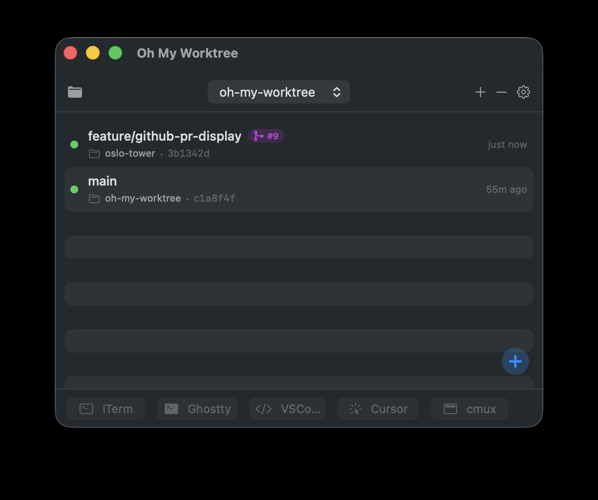
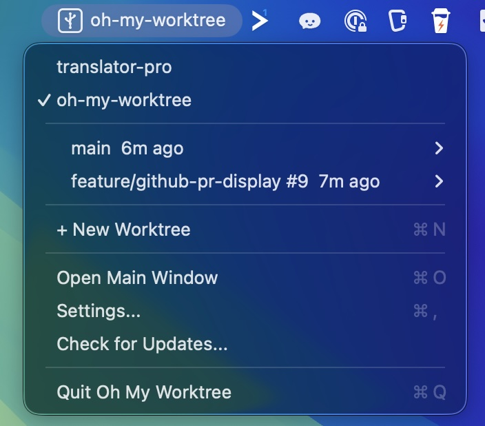

# Oh My Worktree

A native macOS menu bar app for managing Git worktrees with speed and elegance.

<p align="center">
  
</p>

## Features

- **Repository Management** — Register bare Git repositories and switch between them via dropdown menu
- **Worktree Management** — List, create, and delete worktrees with a clean interface
- **Smart Naming** — Automatic random name generation (e.g., `tokyo-lunch`, `bright-ocean`) to keep branch names organized
- **GitHub PR Integration** — Shows PR status badges (#number) next to branch names; click to open PR in browser (requires [`gh` CLI](https://cli.github.com/))
- **External Tool Integration** — Open worktrees directly in iTerm, Ghostty, cmux, VSCode, or Cursor with one click
- **Menu Bar Mode** — Lives in the menu bar with quick-access dropdown for repositories, worktrees, and tool launching
- **`.worktreeinclude` Patterns** — Flexible glob-based file copying when creating new worktrees (falls back to `.env*` files)
- **Activity Tracking** — View relative last activity time per worktree (e.g., "2h ago", "7d ago", "just now")
- **Git Pull** — Pull latest changes for any worktree with result summary and conflict detection
- **Real-Time Branch Detection** — Menu bar title updates instantly when branches change externally
- **Launch at Login** — Start automatically when you log in, configurable in Settings
- **Auto-Update** — Built-in Sparkle update framework, configurable in Settings
- **Lightweight Design** — Runs as a menu bar app without Dock icon; shows in Dock only when a window is open

## Requirements

- **macOS 14.0** (Sonoma) or later
- **Git 2.30** or later
- **Xcode 15** or later (for building from source)

## Installation

### Download

Download the latest release from [GitHub Releases](https://github.com/sapsaldog/oh-my-worktree/releases). Extract the zip and move `OhMyWorktree.app` to `/Applications/`.

### Build from Source

1. Clone the repository:
   ```bash
   git clone https://github.com/sapsaldog/oh-my-worktree.git
   cd oh-my-worktree
   ```

2. Open the Xcode project:
   ```bash
   open OhMyWorktree.xcodeproj
   ```

3. Select the `OhMyWorktree` scheme and build target (⌘B)

4. Run the app (⌘R) or find the built binary in:
   ```
   /Library/Developer/Xcode/DerivedData/OhMyWorktree-.../Build/Products/Release/OhMyWorktree.app
   ```

5. For production use, copy the app to `/Applications/`:
   ```bash
   cp -r OhMyWorktree.app /Applications/
   ```

## Usage

### 1. Register a Repository

Use the **+** button to add a bare Git repository. Select it from the dropdown to see its worktrees.

### 2. Create & Manage Worktrees

Click **+** to create a worktree with an auto-generated name (e.g., `tokyo-lunch`, `bright-ocean`). Each worktree shows its branch, PR status, path, and last activity time.

### 3. Open in Your Favorite Tool

Select a worktree and open it directly in your preferred tool:

| Tool | Description |
|------|-------------|
| **iTerm** | Opens a new terminal window at the worktree path |
| **Ghostty** | Opens Ghostty terminal at the worktree path |
| **cmux** | Opens a cmux workspace at the worktree path |
| **VSCode** | Opens VS Code in the worktree directory |
| **Cursor** | Opens Cursor IDE in the worktree directory |

Tools are auto-detected — only installed tools appear in the menu.

### 4. Menu Bar Quick Access

Access everything from the menu bar without opening the main window. The menu bar icon shows your current `{repo}/{worktree}` selection.

<p align="center">
  
</p>

- Click the menu bar icon to see repositories and worktrees
- Hover a worktree for the tool submenu (iTerm / Ghostty / cmux / VSCode / Cursor / Copy Path / Finder)
- Open associated pull requests directly from the submenu
- Create new worktrees directly from the menu
- Close the main window — the app keeps running in the menu bar

### 5. GitHub PR Integration

If [`gh` CLI](https://cli.github.com/) is installed and authenticated, Oh My Worktree automatically fetches PR data for each worktree branch:

- A colored badge appears next to the branch name (green = open, purple = merged, red = closed)
- Click the badge to open the pull request in your browser
- PR numbers also appear in the menu bar dropdown
- No configuration needed — gracefully hidden when `gh` is not available

### 6. `.worktreeinclude` Patterns

Control which files are copied into new worktrees by creating a `.worktreeinclude` file in your repository root:

```
# Copy environment files
.env*
*.local

# Copy specific config paths
config/local/**
**/settings.local.json
```

- One glob pattern per line, `#` comments and blank lines are ignored
- Simple patterns (e.g., `.env*`) match filenames anywhere in the tree
- Path patterns (e.g., `config/local/**`) match against relative paths
- `**/` prefix patterns match any path suffix
- If no `.worktreeinclude` file exists, all `.env*` files are copied by default
- An empty `.worktreeinclude` file means "copy nothing"

### 7. Settings

Open **Settings** (`⌘,`) from the menu bar to configure global preferences. Use the **⚙** button next to the repository selector for per-repo overrides.

| Setting | Scope | Default |
|---------|-------|---------|
| **Copy files to new worktrees** | Global / Per-repo | On |
| **Launch at Login** | Global | Off |
| **Automatically check for updates** | Global | On |

## Architecture

Oh My Worktree uses a clean MVVM architecture with clear separation of concerns:

### Models
- **Repository** — Registered bare Git repository with metadata (name, path, access times)
- **Worktree** — Git worktree with branch info, commit hash, and activity tracking
- **PullRequestInfo** — GitHub PR data (number, URL, state) fetched via `gh` CLI
- **AppSettings** — User preferences and registered repositories

### ViewModels
- **RepositoryListViewModel** — Manages repository selection and persistence
- **WorktreeListViewModel** — Handles worktree listing, creation, deletion, and PR data fetching

### Views
- **ContentView** — Main application window layout
- **RepositorySelectorView** — Repository dropdown and selection UI
- **WorktreeListView** — Displays list of worktrees with context menu actions
- **WorktreeRowView** — Individual worktree row with PR badge, metadata, and action buttons
- **SettingsView** — Global app settings
- **RepositorySettingsView** — Per-repo settings override popover

### Services
- **GitCommandExecutor** — Low-level `Process`-based Git CLI wrapper
- **WorktreeManager** — Worktree creation, deletion, and git pull operations
- **ExternalToolLauncher** — Opens worktrees in external tools (iTerm, Ghostty, cmux, VSCode, Cursor)
- **PullRequestService** — Fetches GitHub PR data via `gh` CLI
- **RandomNameGenerator** — Generates unique, memorable worktree names
- **WorktreeFileCopier** — Copies files to new worktrees using `.worktreeinclude` patterns
- **RepositoryStore** — Actor-based JSON persistence with atomic writes and backup recovery
- **GitHeadMonitor** — `DispatchSource` file watcher on `.git/HEAD` for real-time branch detection
- **WindowObserver** — Dynamic activation policy toggling for proper window focus management
- **UpdaterManager** — Sparkle auto-update controller wrapper

## Contributing

We welcome contributions! Please see [CONTRIBUTING.md](CONTRIBUTING.md) for guidelines on:
- Reporting bugs
- Submitting features
- Code style and standards
- Testing requirements

## License

Licensed under the MIT License. See [LICENSE](LICENSE) for details.

---

**Oh My Worktree** — Because managing 12 worktrees shouldn't require 12 terminal windows.
