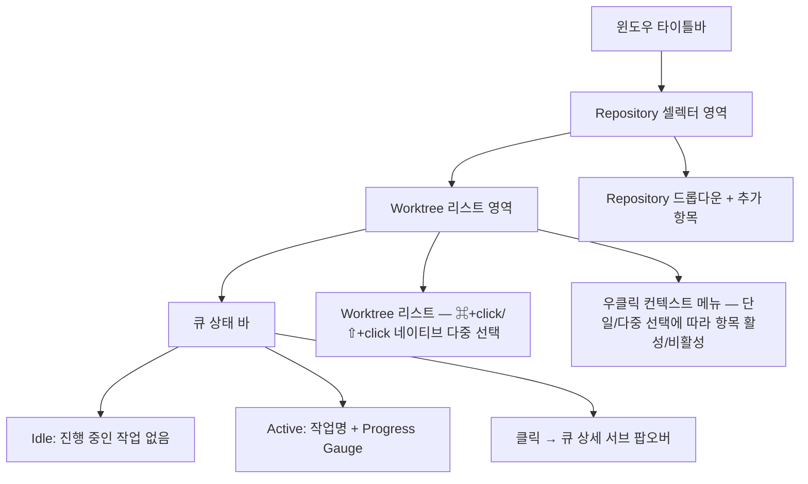
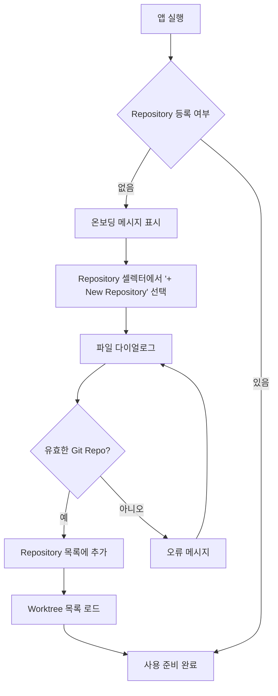
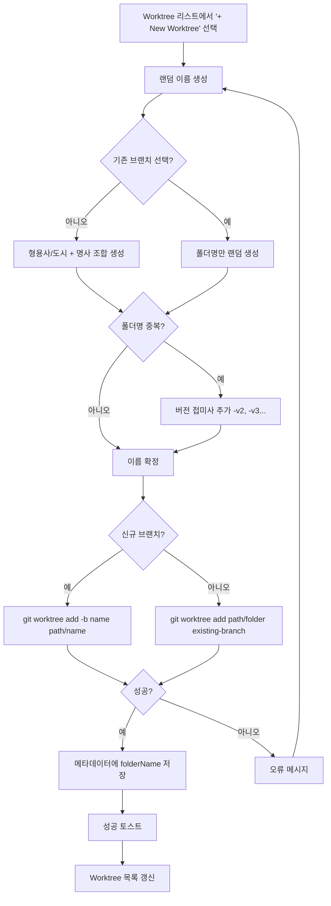
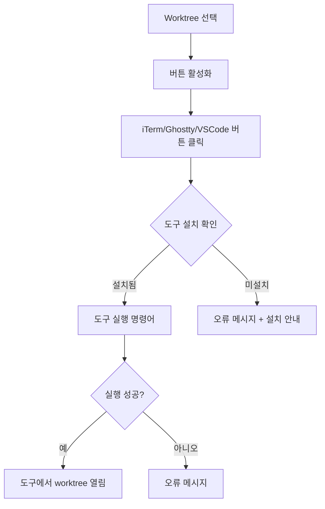
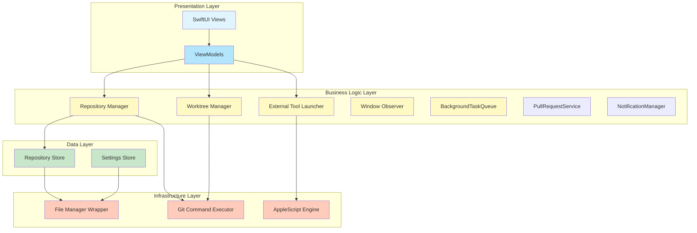
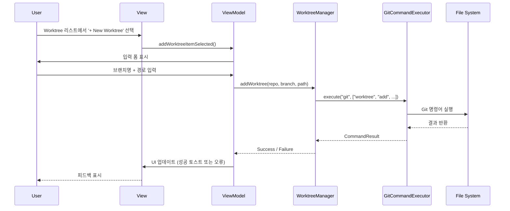
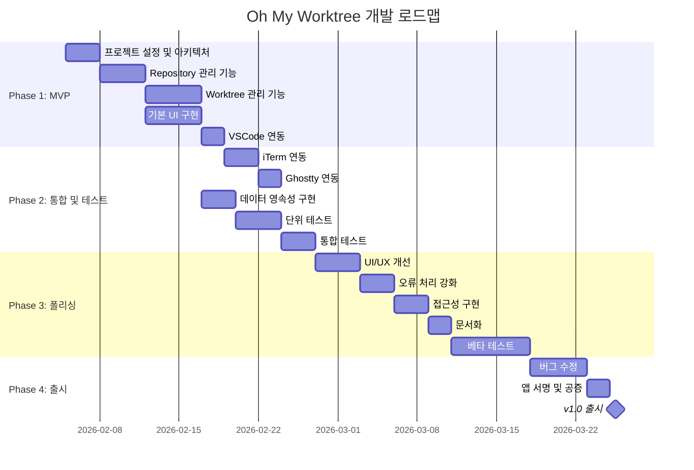

# Oh My Worktree - 제품 요구사항 문서 (PRD)

**버전**: 1.2.2
**작성일**: 2026-03-09
**대상 플랫폼**: macOS 14+ (Sonoma 이상)
**상태**: Draft

---

## 목차

1. [개요](#1-개요)
2. [목표](#2-목표)
3. [비목표](#3-비목표)
4. [사용자 스토리](#4-사용자-스토리)
5. [기능 요구사항](#5-기능-요구사항)
6. [비기능 요구사항](#6-비기능-요구사항)
7. [UI/UX 설계](#7-uiux-설계)
8. [기술 아키텍처](#8-기술-아키텍처)
9. [데이터 모델](#9-데이터-모델)
10. [마일스톤 및 로드맵](#10-마일스톤-및-로드맵)

---

## 1. 개요

### 1.1 제품 설명

**Oh My Worktree**는 Git worktree를 프로젝트별로 관리하는 경량화된 macOS 네이티브 유틸리티 애플리케이션입니다. Conductor와 유사한 접근 방식을 취하지만, 터미널 통합 없이 오로지 Git worktree의 생성, 조회, 삭제 및 외부 도구 연동에만 집중합니다.

### 1.2 배경

개발자들은 동일한 Git 저장소에서 여러 브랜치를 동시에 작업해야 하는 경우가 많습니다. Git worktree는 이를 가능하게 하지만, CLI 기반 관리는 불편하고 시각적 피드백이 부족합니다. Oh My Worktree는 이 문제를 해결하기 위해 간단하고 직관적인 GUI를 제공합니다.

### 1.3 대상 사용자

- Git worktree를 활용하는 소프트웨어 개발자
- 여러 브랜치를 동시에 작업하는 개발자
- macOS를 주 개발 환경으로 사용하는 사용자
- 경량화된 유틸리티 앱을 선호하는 사용자

---

## 2. 목표

### 2.1 핵심 목표

1. **단순성**: Git worktree 관리를 3번의 클릭 이내로 가능하게 함
2. **경량성**: 작은 윈도우 크기와 최소한의 리소스 사용
3. **통합성**: iTerm, Ghostty, VSCode와 원활한 연동
4. **안정성**: Git 명령어 실행 시 오류 처리 및 사용자 피드백

### 2.2 성공 지표

- 앱 실행 후 1초 이내 UI 로딩 완료
- 메모리 사용량 50MB 이하
- worktree 생성 작업 3초 이내 완료
- worktree 삭제 작업 즉시 완료 (휴지통 이동 방식, 파일 수에 무관)
- 외부 도구(iTerm/Ghostty/VSCode) 연동 성공률 99%

---

## 3. 비목표

다음 기능들은 **이번 버전의 범위에 포함되지 않습니다**:

- ❌ 내장 터미널 제공
- ❌ Git 기본 명령어(commit, push 등) 전체 지원 — 단, 원본 worktree의 `git pull`은 제한적으로 지원 (FR-024)
- ❌ 브랜치 병합, 리베이스 등 고급 Git 작업
- ❌ 파일 변경 사항 diff 뷰어
- ❌ Git 히스토리 시각화
- ❌ 멀티 플랫폼 지원 (Windows, Linux)
- ❌ 클라우드 동기화
- ❌ 팀 협업 기능
- ❌ CI/CD 통합
- ❌ 플러그인 시스템

---

## 4. 사용자 스토리

### 4.1 Repository 관리

**US-001**: Repository 추가
**우선순위**: P0
**사용자로서**, 나는 bare repository를 앱에 등록하여 여러 프로젝트를 관리하고 싶다.

**인수 조건**:
- Repository 셀렉터 내에 "+ New Repository" 항목이 표시됨
- 항목 선택 시 파일 다이얼로그를 통해 bare repository 경로 선택 가능
- 유효하지 않은 경로 입력 시 오류 메시지 표시
- 추가된 repository가 셀렉터에 즉시 표시됨

---

**US-002**: Repository 목록 조회
**우선순위**: P0
**사용자로서**, 나는 등록된 모든 repository를 드롭다운 또는 리스트에서 확인하고 싶다.

**인수 조건**:
- 등록된 모든 repository가 이름 또는 경로로 표시됨
- Repository 선택 시 해당 repository의 worktree 목록이 자동으로 로드됨

---

**US-003**: Repository 삭제
**우선순위**: P1
**사용자로서**, 나는 더 이상 사용하지 않는 repository를 목록에서 제거하고 싶다.

**인수 조건**:
- 컨텍스트 메뉴 또는 삭제 버튼으로 repository 제거 가능
- 삭제 확인 다이얼로그 표시
- 실제 디스크의 파일은 삭제되지 않음 (앱 내 등록만 해제)

---

### 4.2 Worktree 관리

**US-004**: Worktree 목록 조회
**우선순위**: P0
**사용자로서**, 나는 선택한 repository의 모든 worktree를 목록으로 확인하고 싶다.

**인수 조건**:
- `git worktree list --porcelain` 명령어 결과가 파싱되어 표시됨
- 각 worktree의 브랜치명, 경로, 상태가 표시됨
- 목록이 비어있을 경우 안내 메시지 표시
- 목록 로드 시마다 현재 브랜치명을 `git worktree list --porcelain`로 검증 (사용자가 CLI에서 브랜치 변경 가능)

---

**US-005**: Worktree 추가
**우선순위**: P0
**사용자로서**, 나는 새로운 브랜치의 worktree를 생성하고 싶다.

**인수 조건**:
- Worktree 리스트 내에 "+ New Worktree" 항목이 표시됨
- 항목 선택 시 폴더명과 브랜치명이 랜덤 단어 조합으로 자동 생성됨 (예: tokyo-lunch, bright-ocean)
- 생성된 이름은 폴더명과 초기 브랜치명으로 동시에 사용됨
- 동일한 폴더명이 존재할 경우 버전 접미사 자동 추가 (v2, v3, ...)
- 기존 브랜치 선택 옵션 제공 (선택 시 폴더명만 자동 생성)
- `git worktree add -b <name> <path/name>` 명령어 실행 후 목록 자동 갱신
- 브랜치명은 생성 후 사용자가 언제든지 변경 가능
- 파일 복사 설정이 활성화된 경우, `.worktreeinclude` 패턴에 매칭되는 파일이 자동 복사됨 (`.worktreeinclude` 미존재 시 `.env*` 파일 폴백)

---

**US-006**: Worktree 삭제
**우선순위**: P0
**사용자로서**, 나는 더 이상 필요하지 않은 worktree를 삭제하고 싶다.

**인수 조건**:
- 삭제 버튼 또는 컨텍스트 메뉴 제공
- 삭제 확인 다이얼로그 표시
- `git worktree remove` 명령어 실행
- 실제 디스크의 파일도 함께 삭제됨 (선택 옵션)

---

**US-006-1**: Worktree 마지막 활동 시간 조회
**우선순위**: P1
**사용자로서**, 나는 각 worktree의 마지막 활동 시간을 상대적으로 확인하고 싶다 (예: "7d ago", "2h ago").

**인수 조건**:
- 각 worktree 행에 마지막 활동 시간이 상대 시간으로 표시됨 (예: "7d ago", "2h ago", "just now")
- 활동 추적 대상: worktree 생성, 외부 도구(iTerm/Ghostty/VSCode/Cursor)에서 열기
- 마지막 git commit 시간도 활동으로 간주 (`git log -1 --format=%ct`)
- 추적된 활동 시간과 마지막 commit 시간 중 더 최신인 것이 "마지막 활동 시간"으로 표시됨
- 활동 시간은 메타데이터에 저장되어 앱 재시작 후에도 유지됨

---

**US-011**: Worktree에서 Git Pull
**우선순위**: P1
**사용자로서**, 나는 bare가 아닌 모든 worktree의 컨텍스트 메뉴에서 git pull을 실행하고 결과를 확인하고 싶다.

**인수 조건**:
- bare가 아닌 모든 worktree(`!worktree.isBare`)의 컨텍스트 메뉴에 "Git Pull" 항목 표시
- bare worktree에는 "Git Pull" 항목 미표시
- Git pull은 백그라운드 작업 큐(FR-031)를 통해 실행됨
- Pull 완료 시 시스템 알림으로 결과 표시 (FR-034)
- 실패 시 기존 에러 알림 패턴으로 오류 표시
- Pull 완료 후 worktree 목록 자동 갱신 (커밋 해시 업데이트)

---

**US-012**: 원본 Worktree 삭제 방지
**우선순위**: P1
**사용자로서**, 나는 원본 repository worktree가 실수로 삭제되지 않도록 보호되기를 원한다.

**인수 조건**:
- 원본 worktree(`worktree.path == repository.path`)의 컨텍스트 메뉴에 "Remove Worktree" / "Force Remove Worktree" 항목 미표시
- `git worktree add`로 생성된 worktree에만 삭제 메뉴 표시
- SwiftUI 컨텍스트 메뉴와 NSMenu 서브메뉴 양쪽 모두 적용

---

**US-013**: GitHub PR에서 Worktree Import
**우선순위**: P1
**사용자로서**, 나는 GitHub Pull Request의 원격 브랜치를 기반으로 worktree를 생성하여 PR 코드를 로컬에서 바로 확인하고 싶다.

**인수 조건**:
- QueueStatusBarView의 스플릿 버튼 드롭다운 또는 메뉴바에서 "Import from GitHub PR..." 선택 시 Import PR 시트 표시
- PR 목록은 Open / Draft / Closed 탭으로 필터링 가능
- 검색 필드로 PR 제목, 번호, 브랜치명으로 필터링 가능
- 각 PR 항목에 상태 아이콘, 번호, 제목, draft 배지, 브랜치, 작성자, 마지막 업데이트 시간 표시
- PR 선택 후 "Import Worktree" 버튼으로 백그라운드 큐에 import 작업 추가
- 동일 PR 브랜치가 이미 checkout된 경우 버전 접미사 자동 생성 (feature/foo-v2, -v3 등)
- Import 완료 시 시트 자동 닫힘
- Import된 worktree에도 PR 배지가 정상 표시됨 (prRemoteBranch 폴백)
- `gh` CLI 미설치 시 graceful degradation

---

### 4.3 외부 도구 연동

**US-007**: iTerm에서 열기
**우선순위**: P0
**사용자로서**, 나는 선택한 worktree를 iTerm에서 바로 열고 싶다.

**인수 조건**:
- iTerm 새 탭 또는 새 윈도우로 열기 (설정 가능)
- 해당 worktree 경로로 자동 이동
- iTerm이 설치되지 않은 경우 안내 메시지 표시

---

**US-008**: Ghostty에서 열기
**우선순위**: P1
**사용자로서**, 나는 선택한 worktree를 Ghostty 터미널에서 바로 열고 싶다.

**인수 조건**:
- Ghostty 새 윈도우로 열기
- 해당 worktree 경로로 자동 이동
- Ghostty가 설치되지 않은 경우 안내 메시지 표시

---

**US-009**: VSCode에서 열기
**우선순위**: P0
**사용자로서**, 나는 선택한 worktree를 VSCode에서 바로 열고 싶다.

**인수 조건**:
- `code` 명령어로 VSCode 실행
- 해당 worktree 경로가 워크스페이스로 열림
- VSCode가 설치되지 않았거나 `code` 명령어가 없는 경우 안내 메시지 표시

---

### 4.4 메뉴바 모드

**US-010-1**: 메뉴바 앱 모드
**우선순위**: P1
**사용자로서**, 나는 메인 윈도우 없이도 메뉴바 아이콘을 통해 worktree에 빠르게 접근하고 싶다.

**인수 조건**:
- macOS 메뉴바(상태바)에 앱 아이콘이 상주함
- 아이콘 옆에 현재 선택된 `{프로젝트명}/{worktree명}`이 표시됨
- 아이콘 클릭 시 드롭다운 메뉴가 열림
- 메뉴 구성:
  - Repository 선택 (서브메뉴로 등록된 repository 목록)
  - 구분선
  - 현재 repository의 worktree 목록 (최근 활동순)
  - 각 worktree 항목에 서브메뉴: iTerm / Ghostty / VSCode / Cursor로 열기
  - 구분선
  - "New Worktree" 항목
  - "Open Main Window" 항목
  - "Quit" 항목
- 메인 윈도우를 닫아도 메뉴바 아이콘은 유지됨

---

### 4.5 설정 관리

**US-010**: 앱 설정 저장
**우선순위**: P1
**사용자로서**, 나는 앱 재시작 후에도 설정이 유지되기를 원한다.

**인수 조건**:
- 등록된 repository 목록이 자동 저장됨
- 윈도우 크기 및 위치가 저장됨
- 외부 도구 연동 설정이 저장됨
- .env 파일 복사 글로벌 설정이 저장됨
- Repository별 .env 복사 오버라이드 설정이 저장됨

---

## 5. 기능 요구사항

### 5.1 Repository 관리 기능

#### FR-001: Repository 추가 (P0)

**설명**: 사용자가 로컬 bare repository를 앱에 등록할 수 있어야 함

**상세 요구사항**:
- Repository 셀렉터 내에 "+ New Repository" 항목 제공
- 항목 선택 시 파일 다이얼로그를 통한 디렉토리 선택
- `.git` 디렉토리 또는 bare repository 유효성 검증
- 중복 repository 추가 방지
- Repository 이름 자동 추출 (디렉토리 이름 기반)
- 수동 이름 변경 가능

**검증 로직**:
```swift
func isValidGitRepository(at path: String) -> Bool {
    let gitPath = "\(path)/.git"
    let bareGitPath = "\(path)/HEAD"
    return FileManager.default.fileExists(atPath: gitPath) ||
           FileManager.default.fileExists(atPath: bareGitPath)
}
```

---

#### FR-002: Repository 목록 표시 (P0)

**설명**: 등록된 모든 repository를 시각적으로 표시

**상세 요구사항**:
- 드롭다운 또는 리스트 UI 컴포넌트 사용
- Repository 이름과 경로 표시
- 선택된 repository 하이라이트
- 빈 목록일 경우 onboarding 메시지 표시

---

#### FR-003: Repository 삭제 (P1)

**설명**: 등록된 repository를 목록에서 제거

**상세 요구사항**:
- 컨텍스트 메뉴 또는 삭제 버튼
- 삭제 확인 다이얼로그 (실수 방지)
- 실제 파일은 삭제하지 않음 (앱 내 등록만 해제)

---

### 5.2 Worktree 관리 기능

#### FR-004: Worktree 목록 조회 (P0)

**설명**: 선택된 repository의 모든 worktree를 조회 및 표시

**상세 요구사항**:
- `git worktree list --porcelain` 명령어 실행
- 결과 파싱하여 구조화된 데이터로 변환
- 각 worktree의 다음 정보 표시:
  - 브랜치명 (항상 `git worktree list --porcelain`에서 실시간 조회)
  - 경로 (절대 경로)
  - 상태 (detached, bare 등)
  - HEAD 커밋 해시 (선택적)
- **중요**: 브랜치명은 메타데이터에 저장하지 않고, 매번 목록 로드 시 `git worktree list --porcelain`로 확인
- 이유: 사용자가 CLI에서 브랜치를 변경할 수 있으므로 실시간 동기화 필요
- 목록은 마지막 활동 시간 기준 내림차순 정렬 (가장 최근 활동이 위로)
- **자동 갱신**: 앱이 활성화될 때(`didBecomeActiveNotification`) 및 메뉴바 드롭다운 열 때 자동으로 목록 갱신
- 2초 디바운싱으로 중복 갱신 방지, Task 기반 재진입 방지로 race condition 해소
- 메뉴바 갱신 시 데이터 변경이 있는 경우에만 메뉴 재구성 (깜빡임 방지)

**데이터 파싱 예시**:
```
worktree /path/to/worktree
HEAD abc123def456
branch refs/heads/feature/new-feature
```

---

#### FR-005: Worktree 추가 (P0)

**설명**: 새로운 worktree를 자동 생성된 이름으로 생성

**상세 요구사항**:
- Worktree 리스트 내에 "+ New Worktree" 항목 제공
- 항목 선택 시 자동으로 랜덤 이름 생성 (FR-015 참조)
- 생성된 이름은 폴더명과 초기 브랜치명으로 동시 사용
- 기존 브랜치 선택 옵션 제공 (선택 시 폴더명만 자동 생성)
- Worktree 생성 경로: `~/oh-my-worktree/workspaces/{repository_name}/{worktree_name}`
- Git 명령어 실행:
  - 신규 브랜치 (기본): `git worktree add -b <name> ~/oh-my-worktree/workspaces/<repo>/<name>`
  - 기존 브랜치: `git worktree add ~/oh-my-worktree/workspaces/<repo>/<folder> <existing-branch>`
- 폴더명 중복 시 자동으로 버전 접미사 추가 (tokyo-lunch-v2, tokyo-lunch-v3)
- 실행 결과 피드백 (성공/실패 메시지)
- 성공 시 worktree 목록 자동 갱신
- 생성된 폴더명은 메타데이터에 저장 (FR-013 참조)

---

#### FR-006: Worktree 삭제 (P0)

**설명**: 기존 worktree를 제거. 3가지 삭제 방식 제공

**상세 요구사항**:
- **삭제 방식 3가지**:
  1. **Remove Worktree**: `git worktree remove <path>` — uncommitted changes가 있으면 거부 (dirty check)
  2. **Force Remove Worktree**: `git worktree remove --force <path>` — dirty 상태여도 강제 삭제
  3. **Quick Remove Worktree** (FR-036): `FileManager.trashItem` + `git worktree prune` — 즉시 완료, 휴지통에서 복구 가능
- Force Remove 시 삭제 확인 다이얼로그
- 실행 결과 피드백
- 성공 시 worktree 목록 자동 갱신

---

### 5.3 외부 도구 연동 기능

#### FR-007: iTerm 연동 (P0)

**설명**: 선택된 worktree를 iTerm에서 열기

**상세 요구사항**:
- `open <path> -a iTerm` 명령어로 실행
- iTerm 미설치 시 오류 처리

---

#### FR-008: Ghostty 연동 (P1)

**설명**: 선택된 worktree를 Ghostty 터미널에서 열기

**상세 요구사항**:
- `open -a Ghostty <path>` 명령어로 실행
- Ghostty 미설치 시 오류 처리

---

#### FR-009: VSCode 연동 (P0)

**설명**: 선택된 worktree를 VSCode에서 열기

**상세 요구사항**:
- `code` CLI 명령어 사용
- 명령어: `code /path/to/worktree`
- `code` 명령어 미설치 시:
  - 설치 안내 메시지
  - VSCode 앱 직접 실행 대체 방법 (open -a "Visual Studio Code" /path)
- 설정 옵션:
  - 새 윈도우로 열기 (`-n` 플래그)
  - 현재 윈도우에 추가 (`-a` 플래그)

---

#### FR-009-1: Cursor 연동 (P1)

**설명**: 선택된 worktree를 Cursor 에디터에서 열기

**상세 요구사항**:
- `open <path> -a Cursor` 명령어로 실행
- Cursor 미설치 시 오류 처리

---

### 5.4 UI/UX 기능

#### FR-017: 메뉴바 앱 모드 (P1)

**설명**: macOS 메뉴바에 상주하는 상태 아이콘과 드롭다운 메뉴 제공

**상세 요구사항**:
- `NSStatusItem`을 사용한 메뉴바 아이콘 구현
- 아이콘 옆 타이틀: `{repository_name}/{worktree_name}` (현재 선택된 항목)
- 클릭 시 `NSMenu` 드롭다운 표시
- 메뉴 구조:
  ```
  ┌──────────────────────────────┐
  │ ✓ MyProject                  │ ← Repository 선택
  │   AnotherProject             │
  ├──────────────────────────────┤
  │ ● main              2h ago  │ ← Worktree 목록
  │   tokyo-lunch        7d ago  │
  │   bright-ocean      16d ago  │
  ├──────────────────────────────┤
  │ + New Worktree               │
  │ Import from GitHub PR…       │  ← GitHub PR Import
  ├──────────────────────────────┤
  │ Open Main Window             │
  │ Settings...                  │
  │ Check for Updates...         │
  │ Quit Oh My Worktree          │
  └──────────────────────────────┘
  ```
- 각 worktree 항목 클릭 시 서브메뉴:
  - Open in iTerm
  - Open in Ghostty
  - Open in VSCode
  - Open in Cursor
  - Copy Path
  - Show in Finder
- 앱 라이프사이클:
  - 메인 윈도우 닫기 시 앱 종료하지 않음 (메뉴바에 유지)
  - `LSUIElement` (Info.plist) 또는 `NSApp.setActivationPolicy(.accessory)` 사용
  - "Open Main Window" 선택 시 메인 윈도우 복원
- 메뉴바 인터랙션 시 메인 윈도우 자동 표시:
  - Repository 선택 시 → 메인 윈도우 표시 (worktree 목록 확인 가능)
  - Git Pull 실행 시 → 메인 윈도우 표시 (결과 alert 표시)
  - 일관된 UX: 메뉴 액션 후 항상 시각적 피드백 제공
- 설정에서 메뉴바 모드 on/off 전환 가능

---

#### FR-026: 동적 Activation Policy — 윈도우 포커스 복구 (P1)

**설명**: 윈도우 가시성에 따라 `NSApplication.ActivationPolicy`를 동적으로 전환하여 Cmd+\` 및 Cmd+Tab을 통한 윈도우 포커스 복구 지원

**배경**:
- `.accessory` 모드에서는 Dock 아이콘과 Cmd+Tab이 비활성화되어, 메인 윈도우가 포커스를 잃으면 메뉴바 아이콘 클릭 외에 복구 수단 없음
- 1Password, Bartender 등 주요 macOS 유틸리티에서 사용하는 표준 패턴 적용

**상세 요구사항**:
- `WindowObserver` 서비스: 윈도우 라이프사이클 이벤트 감시
  - `NSWindow.didBecomeKeyNotification` — 윈도우 활성화
  - `NSWindow.willCloseNotification` — 윈도우 닫힘
  - `NSWindow.didMiniaturizeNotification` — 윈도우 최소화
  - `NSWindow.didDeminiaturizeNotification` — 최소화 해제
- Activation Policy 전환 로직:
  - 앱 윈도우가 1개 이상 visible 또는 miniaturized → `.regular` (Dock + Cmd+Tab 활성)
  - 모든 앱 윈도우 닫힘 → `.accessory` (Dock 아이콘 숨김, 메뉴바 전용)
- `.regular` 전환 시 `NSApp.activate()` 호출하여 즉시 Dock/Cmd+Tab 등록
- 트랜지언트 윈도우 필터링:
  - `NSStatusBarWindow`, `_NSPopoverWindow`, `NSToolTipPanel` 등 시스템 윈도우 제외
  - `window.level == .normal` 및 `.titled` 스타일 마스크 확인
- Dock 아이콘 클릭 시 (`applicationShouldHandleReopen`) 윈도우가 없으면 메인 윈도우 생성
- 초기 정책: `applicationDidFinishLaunching`에서 `.accessory`로 설정 (기존 `.onAppear` 설정 제거)

**영향받는 컴포넌트**:
- `WindowObserver` (신규 서비스)
- `AppDelegate`: WindowObserver 통합, `applicationShouldHandleReopen` 추가, `openMainWindowClicked` 중복 코드 제거
- `OhMyWorktreeApp`: `.onAppear`에서 `setActivationPolicy(.accessory)` 제거

**검증 시나리오**:
1. 앱 실행 → 메인 윈도우 표시, Dock 아이콘 나타남, Cmd+Tab에 앱 표시
2. 다른 앱 클릭 → Dock 아이콘 유지, Cmd+\`로 윈도우 복귀 가능
3. 메인 윈도우 닫기 → Dock 아이콘 사라짐, 메뉴바 전용 모드
4. 메뉴바에서 윈도우 열기 → Dock 아이콘 재등장
5. Settings 열기 → Dock 아이콘 표시; Settings만 닫고 메인 윈도우 유지 → Dock 아이콘 유지
6. 모든 윈도우 닫기 → Dock 아이콘 사라짐
7. Dock 아이콘 클릭 (윈도우 없는 상태) → 메인 윈도우 생성

---

#### FR-027: .worktreeinclude 파일 지원 (P1)

**설명**: Repository 루트에 `.worktreeinclude` 파일을 통해 worktree 생성 시 복사할 파일 패턴을 사용자가 지정

**상세 요구사항**:
- `.worktreeinclude` 파일이 repository 루트에 존재하면 해당 파일의 glob 패턴을 사용
- `.worktreeinclude` 파일이 없으면 기존 `.env*` 파일 복사 동작 유지 (하위호환)
- 빈 `.worktreeinclude` 파일은 아무 파일도 복사하지 않음
- 파일 포맷:
  - UTF-8 인코딩
  - `#`으로 시작하는 줄은 주석
  - 빈 줄은 무시
  - 그 외 줄은 glob 패턴
- 패턴 매칭 (`Darwin.fnmatch` 기반):
  - 슬래시(`/`) 없는 패턴: 파일명만 매칭 (예: `.env*` → 모든 깊이의 `.env`, `.env.local`)
  - 슬래시 있는 패턴: 전체 상대경로 매칭 (예: `config/local.yml`)
  - `**/` 접두사: 모든 깊이에서 tail 패턴 매칭 (예: `**/*.local.json`)
- `.worktreeinclude` 예시:
  ```
  # Environment files
  .env*

  # Local configuration
  config/local.yml
  **/*.local.json

  # IDE settings
  .vscode/settings.json
  ```

**영향받는 컴포넌트**:
- `WorktreeFileCopier` (기존 `EnvFileCopier` 대체)
- FR-018과 연동: FR-018의 파일 복사 로직이 `.worktreeinclude` 패턴을 우선 사용

---

#### FR-028: GitHub PR 번호 표시 (P1)

**설명**: Worktree의 브랜치에 연결된 GitHub Pull Request 번호를 UI에 표시하고, 클릭 시 브라우저에서 PR 페이지를 열 수 있음

**상세 요구사항**:
- `gh` CLI를 사용하여 GitHub PR 정보를 가져옴 (`gh pr list --json number,url,headRefName,state --state all --limit 100`)
- `gh` CLI 미설치, 미인증, 또는 GitHub 외 리모트인 경우 graceful degradation (빈 결과)
- PR 정보는 브랜치명 기준으로 매핑 (`[String: PullRequestInfo]`)
- Worktree 목록 로드 시 비동기 side task로 PR 정보를 가져옴
- Repository 전환 시 이전 PR fetch task를 취소하고 새로 시작
- `PullRequestInfo` 모델: `number`, `url` (URL 타입), `branch`, `state`, `title`, `author`, `updatedAt`, `isDraft`
- `PullRequestFetching` 프로토콜 (3개 메서드):
  - `fetchPullRequests(repositoryPath:)` → `[String: PullRequestInfo]` (브랜치 기준 dict)
  - `isGitHubAvailable(repositoryPath:)` → `Bool` (gh CLI 사용 가능 여부)
  - `fetchPullRequestList(repositoryPath:)` → `[PullRequestInfo]?` (Import PR 시트용, `gh pr list --json number,url,headRefName,state,title,author,updatedAt,isDraft`)
- PR 배지 매칭 폴백 체인: `worktree.branch` → `worktree.prRemoteBranch` (Import된 워크트리의 로컬 브랜치명이 원격과 다를 수 있으므로)

**영향받는 컴포넌트**:
- `PullRequestInfo` (모델, title/author/updatedAt/isDraft 필드 추가)
- `PullRequestService` (서비스, `PullRequestFetching` 프로토콜)
- `WorktreeListViewModel` (PR 데이터 상태 관리, prRemoteBranch 폴백 매칭)
- `WorktreeRowView` (PR 배지 표시)
- `AppDelegate` (메뉴바 PR 번호 표시)
- `ImportPRViewModel` (PR 목록 시트용 ViewModel)

---

#### FR-029: GitHub PR 상태 아이콘 표시 (P2)

**설명**: PR의 상태(open/merged/closed)를 GitHub 옥티콘 스타일 아이콘과 색상으로 시각적으로 구분

**상세 요구사항**:
- `PullRequestState` enum: `open` (OPEN), `merged` (MERGED), `closed` (CLOSED)
- `gh pr list --state all`로 모든 상태의 PR을 가져옴
- 같은 브랜치에 여러 PR이 있을 경우 open 상태가 우선
- `state` 필드 누락 시 `.open`으로 기본값 처리
- GitHub 옥티콘 SVG 아이콘을 Asset Catalog에 template 이미지로 등록:
  - `PROpen` (git-pull-request, 초록)
  - `PRMerged` (git-merge, 보라)
  - `PRClosed` (git-pull-request-closed, 빨강)
- Worktree row의 PR 배지: 12px 아이콘 + `#번호`, 상태별 색상 capsule
- 색상 매핑: open → green, merged → purple, closed → red

**영향받는 컴포넌트**:
- `PullRequestInfo` (state 필드 추가)
- `PullRequestState` (enum, Model 레이어)
- `PullRequestService` (state 파싱, `--state all`)
- `PullRequestStateIcon` (SwiftUI 뷰, 아이콘 렌더링)
- `WorktreeRowView` (상태 색상 배지)
- Asset Catalog (PROpen/PRMerged/PRClosed imageset)

---

#### FR-031: 범용 비동기 작업 큐 — BackgroundTaskQueue (P1)

**설명**: git 작업(삭제, pull 등) 시간이 걸리는 모든 작업을 범용 비동기 큐로 관리

**상세 요구사항**:
- `BackgroundTaskQueue`: 범용 비동기 큐 (actor 기반)
- `BackgroundJob`: 개별 작업 단위
  - `id: UUID`
  - `worktreeID: UUID` — 어느 워크트리의 작업인지 (UI 상태 표시용)
  - `displayName: String` — 삭제 완료 후에도 이름 표시 가능
  - `repositoryPath: String`
  - `worktreePath: String` — 워크트리 디렉토리 전체 경로
  - `folderName: String` — 메타데이터 저장용 폴더명
  - `repositoryID: UUID` — 리포지토리별 충돌 검사 스코프
  - `kind: BackgroundJobKind`
  - `state: BackgroundJobState` — `.pending` / `.inProgress` / `.completed` / `.failed(String)` / `.cancelled`
  - `enqueuedAt: Date`
- `BackgroundJobKind`: `.removeWorktree(force: Bool)`, `.quickRemove`, `.pull`, `.addWorktreeFromPR(remoteBranch: String, localBranch: String, prNumber: Int)`
- 저장소별 직렬 처리 (같은 저장소의 작업은 순차 실행 — `.git/worktrees/` lock 충돌 방지)
- 실패 시 해당 작업 건너뛰고 다음 작업 계속 진행
- 단일 작업 enqueue 및 배치 enqueue(`[BackgroundJob]`) 모두 지원
- pending 상태의 작업은 개별 취소 가능
- 대기중 전체 취소(`cancelPending`) 지원
- 작업 타임아웃 메커니즘: `jobTimeoutSeconds` (기본 60초), 초과 시 `BackgroundJobTimeoutError` 발생
  - `withThrowingTaskGroup`으로 작업과 타임아웃 sleep을 레이싱
- 실패 작업 최대 보유 수: `maxFailedJobs = 50`

**BackgroundJobState 전이**:
```
.pending → .inProgress → .completed
                       → .failed(String)
.pending → .cancelled
```

**영향받는 컴포넌트**:
- `BackgroundTaskQueue` (신규 서비스, actor)
- `BackgroundJob` (신규 모델)
- `BackgroundJobKind` (신규 enum)
- `BackgroundJobState` (신규 enum)
- `WorktreeListViewModel` (큐 상태 구독, 기존 `isLoading`/`pullingWorktrees` 대체)

---

#### FR-032: 다중 선택 및 일괄 작업 (P1)

**설명**: 여러 워크트리를 선택하여 한 번에 작업 큐에 추가. 별도 "선택 모드" 없이 macOS 네이티브 다중 선택 방식 사용.

**설계 결정 — iOS 스타일 Select 버튼 제거**:
- "Select" 텍스트 토글 버튼 및 체크박스 방식은 iOS 패턴 → macOS에서 이질감
- 대신 SwiftUI `List`의 네이티브 다중 선택(`Set<Worktree.ID>`)을 그대로 활용
- 별도 선택 모드 진입/해제 없이 항상 ⌘+click / ⇧+click 으로 다중 선택 가능

**상세 요구사항**:
- `⌘+click`: 개별 항목 선택/해제 (비연속 다중 선택)
- `⇧+click`: 범위 선택 (연속 다중 선택)
- `⌘+A`: 전체 선택 (root 워크트리 제외)
- `Esc`: 선택 해제

**컨텍스트 메뉴 동작 (우클릭)**:
- **1개 선택 시**: 기존 메뉴 그대로 (Rename, Open in iTerm/VSCode 등)
- **2개 이상 선택 시**:
  - `Open in ...` 계열 항목: disabled
  - `Rename`: disabled
  - `Git Pull`: disabled
  - `Quick Remove Worktree` / `Remove Worktree` / `Force Remove`: 선택된 항목 전체에 일괄 enqueue (root 제외, 실행 가능)
  - `Show in Finder`, `Copy Path`: disabled

**원본 워크트리(root) 제약**:
- root 워크트리가 다중 선택에 포함된 경우 Quick Remove Worktree/Remove/Force Remove는 root를 제외하고 나머지만 enqueue
- root만 선택된 경우 삭제 관련 항목 disabled

**큐에 추가된 워크트리 행**: per-row 상태 아이콘 표시 (⏳ 대기, ⟳ 진행 중)
**완료된 워크트리**: 목록에서 즉시 제거

**영향받는 컴포넌트**:
- `WorktreeListViewModel` (`selectedWorktreeIDs: Set<Worktree.ID>` 유지, `isSelectionMode` 제거)
- `WorktreeListView` (선택 모드 토글/체크박스 제거, 네이티브 List 다중 선택 사용)
- `WorktreeRowView` (체크박스 제거, per-row 상태 아이콘 유지)
- `BackgroundTaskQueue` (배치 enqueue)

---

#### FR-033: 큐 상태 바 (P1)

**설명**: `ActionButtonsView`를 대체하는 하단 큐 상태 바. 진행 중인 작업 요약 및 상세 팝오버 진입점 제공.

**ActionButtonsView 제거 배경**:
- iTerm, Ghostty, VSCode, Cursor, cmux, 삭제 버튼은 모두 우클릭 컨텍스트 메뉴로 접근 가능
- 하단 바를 큐 관련 전용 공간으로 활용

**상태 바 상세 요구사항**:
- 항상 표시 (Idle/Active 모두)
- **스플릿 버튼 (addSplitButton)**:
  - `+` (plus) 버튼: 새 worktree 생성 (기존 "+ New Worktree" 동작)
  - 셰브론(▼) 드롭다운 메뉴: "Import from GitHub PR..." 항목
  - 둥근 사각형 테두리로 시각적 그룹핑
- **Idle 상태**: 빈 상태 텍스트 (예: "진행 중인 작업 없음")
- **Active 상태**:
  - 현재 실행 중인 작업명 표시 (예: "feature/login 삭제 중...")
  - Determinate progress gauge: `완료된 작업 수 / 전체 작업 수` 기반
  - 예: 3개 큐, 1개 완료 → 33%
- **Failed 상태**: 빨간 느낌표 아이콘 + "N failed (tap to review)" 텍스트
- 상태 바 클릭 → 큐 상세 서브 팝오버 오픈
- 배치 액션은 컨텍스트 메뉴(우클릭)로 처리 — 별도 배치 액션 바 불필요

**큐 상세 서브 팝오버**:
- 전체 작업 순차 목록
- 각 항목: 상태 아이콘 + 작업명 + 종류 + 개별 `[×]` (pending 상태만)
- `[모두 취소]` 버튼 (pending 작업 존재 시)
- `[Clear Failed]` 버튼 (실패 작업 존재 시)
- 작업 없을 때: "진행 중인 작업 없음" 표시

**메뉴바 컨텍스트 메뉴 변경**:
- 삭제 큐에 들어간 워크트리는 메뉴바 NSMenu 목록에서 필터링

**영향받는 컴포넌트**:
- `ActionButtonsView` (제거)
- `QueueStatusBarView` (신규 — 큐 상태 바)
- `QueueDetailPopoverView` (신규 — 상세 팝오버)
- `ContentView` (ActionButtonsView → QueueStatusBarView 교체)
- `AppDelegate` (메뉴바 목록 필터링 로직 추가)

---

#### FR-034: 백그라운드 작업 완료 시스템 알림 (P2)

**설명**: 백그라운드 큐의 작업이 완료되거나 실패할 때 macOS 시스템 알림(UNUserNotificationCenter)을 통해 사용자에게 결과를 전달. 팝오버가 닫혀있어도 알림을 수신할 수 있음.

**설계 결정 — macOS 시스템 알림 채택**:
- 팝오버 내 인라인 토스트는 팝오버가 열려있을 때만 유효 → 발견성 낮음
- `QueueStatusBarView` 팝오버가 이미 진행 중 상태를 표시하므로 중복
- 시스템 알림은 팝오버 닫힘 여부와 관계없이 도달 → 장시간 작업(pull, 다중 삭제)에 적합

**알림 발송 조건**:
- `.completed` (remove/pull): 작업 성공 시 배너 알림
- `.failed`: 작업 실패 시 Critical 사운드와 함께 배너 알림

**알림 내용**:
- **성공 (remove/moveToTrash)**: Title "Oh My Worktree" / Body "'워크트리명' removed"
- **성공 (pull)**: Title "Oh My Worktree" / Body "'워크트리명' pulled successfully"
- **성공 (addWorktreeFromPR)**: Title "Oh My Worktree" / Body "PR #번호 imported successfully"
- **실패**: Title "Oh My Worktree — Task Failed" / Body 에러 메시지 (워크트리명 포함)

**포그라운드 동작**:
- `UNUserNotificationCenterDelegate.willPresent` 구현으로 앱 팝오버가 열린 상태에서도 배너 표시

**권한 요청**:
- `WorktreeListViewModel.init()` 시점에 `requestAuthorization(options: [.alert, .sound])` 호출
- 최초 실행 시 시스템 권한 프롬프트 표시; 이후 저장

**영향받는 컴포넌트**:
- `NotificationManager` (신규 — `UNUserNotificationCenterDelegate` 구현체)
- `WorktreeListViewModel` (init에서 권한 요청, `onJobStateChange`에서 알림 발송)

---

#### FR-035: GitHub PR에서 Worktree Import (P1)

**설명**: GitHub Pull Request의 원격 브랜치를 기반으로 worktree를 생성하여 PR 코드를 로컬에서 검토 가능

**상세 요구사항**:
- **Import PR 시트 (ImportPRView)**:
  - 3-탭 Picker: Open / Draft / Closed (`PRTab` enum)
  - 검색 필드: PR 제목, 번호, 브랜치명으로 필터링
  - PR 목록: 상태 아이콘, 번호, 제목, draft 배지, 브랜치, 작성자, 상대적 업데이트 시간 표시
  - Cancel / "Import Worktree" 버튼
  - 빈 상태: "No Pull Requests", "No {Tab} Pull Requests", "No Results" (검색 시), 로드 실패 시 Retry 버튼
- **Import PR ViewModel (ImportPRViewModel)**:
  - `PullRequestService.fetchPullRequestList()` 호출하여 PR 목록 로드
  - `filteredPRs`: 탭 + 검색 텍스트 기반 필터링
  - Retry 메커니즘
- **진입점**:
  - QueueStatusBarView: 스플릿 버튼의 셰브론(▼) 드롭다운 → "Import from GitHub PR..."
  - 메뉴바 NSMenu: "Import from GitHub PR..." 항목 (FR-017, "+ New Worktree" 아래)
  - 두 진입점 모두 `isShowingImportPR = true` 트리거
- **백그라운드 큐 통합**:
  - `BackgroundJob`의 `kind: .addWorktreeFromPR(remoteBranch:, localBranch:)` 로 enqueue
  - 실행 흐름: `fetchBranch` → `addWorktreeFromRemoteBranch` (`git worktree add -B`) → 메타데이터 저장 (prRemoteBranch 포함) → 파일 복사 → worktree 목록 갱신
  - 완료 시 Import PR 시트 자동 닫힘
- **폴더명 생성**:
  - PR Import 시 항상 `RandomNameGenerator.generate()`로 폴더명 생성 (PR 브랜치명 사용하지 않음)
- **중복 PR 브랜치 처리**:
  - 동일 PR 브랜치가 이미 checkout된 경우 버전 접미사 자동 생성 (예: `feature/foo-v2`, `-v3`)
  - 기존 worktree 브랜치 + 큐에 대기 중인 작업 브랜치 모두 충돌 검사
  - 충돌 검사 스코프: 리포지토리별 (`repositoryID`)
- **PR 배지 연동**:
  - Import된 worktree의 메타데이터에 `prRemoteBranch` 저장
  - PR 배지 매칭 시 `worktree.branch` → `worktree.prRemoteBranch` 폴백 (FR-028)

**영향받는 컴포넌트**:
- `ImportPRView` (신규 — Import PR 시트 뷰)
- `ImportPRViewModel` (신규 — PR 목록 관리)
- `PullRequestService` (`fetchPullRequestList` 메서드)
- `BackgroundTaskQueue` (`.addWorktreeFromPR` 작업 실행)
- `BackgroundJob` (`kind: .addWorktreeFromPR`)
- `WorktreeMetadata` (`prRemoteBranch` 필드)
- `WorktreeManager` (`fetchBranch`, `addWorktreeFromRemoteBranch` 메서드)
- `QueueStatusBarView` (스플릿 버튼 드롭다운)
- `AppDelegate` (메뉴바 "Import from GitHub PR..." 항목)
- `NotificationManager` (Import 완료 알림)

---

#### FR-036: Worktree 삭제 시 휴지통 이동 방식 (P1)

**설명**: "Quick Remove Worktree" 메뉴 항목 추가 — macOS 휴지통으로 이동 후 `git worktree prune`을 실행하여 삭제 속도를 대폭 개선. 기존 Remove/Force Remove는 유지

**배경**:
- `git worktree remove`는 내부적으로 worktree 디렉토리를 재귀적으로 삭제
- `node_modules`, `.next`, `build` 등 대량 파일이 존재하는 프로젝트에서 삭제에 수십 초~수 분 소요
- 기존 60초 타임아웃으로도 부족한 경우 발생
- macOS `FileManager.trashItem`은 같은 볼륨 내 rename 수준으로 즉시 완료

**상세 요구사항**:
- **컨텍스트 메뉴에 "Quick Remove Worktree" 항목 추가** (기존 Remove Worktree / Force Remove Worktree 유지):
  ```
  Remove Worktree          ← git worktree remove (dirty check)
  Force Remove Worktree    ← git worktree remove --force
  Quick Remove Worktree            ← FileManager.trashItem + prune (즉시, 복구 가능)
  ```
- **Quick Remove Worktree 흐름**:
  1. `FileManager.trashItem(at:resultingItemURL:)`으로 worktree 디렉토리를 휴지통으로 이동 (즉시 완료)
  2. `git worktree prune`으로 git 메타데이터(`.git/worktrees/<name>`) 정리
  3. `RepositoryStore.removeWorktreeMetadata()`로 앱 메타데이터 정리
- **복구 가능성**: 사용자가 실수로 삭제한 경우 macOS 휴지통에서 디렉토리 복구 가능 (단, git worktree 등록은 수동 재등록 필요)
- **다중 선택 지원**: 기존 일괄 Remove/Force Remove와 동일하게 다중 선택 시 "Quick Remove Worktree" 일괄 enqueue
- **BackgroundJobKind 추가**: `.quickRemove` — 기존 `.removeWorktree(force:)`와 별도
- **기존 동작 유지**:
  - Remove Worktree / Force Remove Worktree는 기존 `git worktree remove` 방식 그대로
  - 디렉토리가 이미 수동 삭제된 경우: 기존과 동일하게 `git worktree prune` 실행
  - 메타데이터 정리, UI 업데이트, 시스템 알림 등 후처리는 변경 없음

**영향받는 컴포넌트**:
- `WorktreeManager` (`quickRemoveWorktree` 메서드 신규)
- `BackgroundJobKind` (`.quickRemove` 추가)
- `BackgroundTaskQueue` (`executeJob` — `.quickRemove` 케이스 처리)
- `WorktreeListView` (컨텍스트 메뉴 "Quick Remove Worktree" 항목 추가)
- `WorktreeListViewModel` (`quickRemoveWorktree` 메서드 신규)
- `AppDelegate` (메뉴바 NSMenu "Quick Remove Worktree" 항목 추가)

---

#### FR-037: 백그라운드 작업 타임아웃 설정 (P2)

**설명**: Remove Worktree / Force Remove Worktree의 타임아웃 시간을 Settings에서 변경 가능. 타임아웃 발생 시 안내 메시지 제공

**배경**:
- 기존 타임아웃 60초는 `node_modules` 등 대량 파일 프로젝트에서 부족할 수 있음
- "Quick Remove Worktree"를 사용하면 즉시 완료되지만, 사용자가 Remove/Force Remove를 선호하는 경우에도 대응 필요
- 타임아웃 발생 시 사용자가 원인을 파악하고 조치할 수 있도록 안내 필요

**상세 요구사항**:
- **Settings UI (Advanced 섹션)**:
  - "Background task timeout" 라벨 + 숫자 직접 입력 가능한 TextField (초 단위, 우측 정렬, 60px 너비) + "s" 접미사
  - 기본값: 60초, 범위: 30~600초 (범위 밖 입력 시 자동 clamp)
  - 캡션: "Maximum time allowed for Remove / Force Remove operations (30–600s). Quick Remove Worktree is not affected by this setting."
- **AppSettings 확장**:
  - `jobTimeoutSeconds: Int` 필드 추가 (기본값 60)
  - `@AppStorage("jobTimeoutSeconds")` 바인딩
- **BackgroundTaskQueue 연동**:
  - 초기화 시 AppSettings의 값을 `jobTimeoutSeconds`로 전달
  - Settings 변경 시 새로 enqueue되는 작업부터 적용
- **타임아웃 에러 메시지 개선**:
  - 기존: `"Operation timed out after 60 seconds"`
  - 변경: `"Operation timed out after {N} seconds. Projects with large directories (e.g. node_modules) may need more time. You can increase the timeout in Settings > Advanced, or use 'Quick Remove Worktree' for instant removal."`

**영향받는 컴포넌트**:
- `AppSettings` (`jobTimeoutSeconds` 필드 추가)
- `SettingsView` (Advanced 섹션 추가)
- `BackgroundTaskQueue` (타임아웃 값 AppSettings 연동)
- `BackgroundJobTimeoutError` (에러 메시지 개선)

---

#### FR-030: Worktree 이름 변경 (Rename) (P1)

**설명**: Worktree에 사용자 지정 이름(customName)을 설정하여 표시 이름을 변경할 수 있음. 이름을 비우면 기존 표기 룰(브랜치명 또는 Detached)로 복귀.

**상세 요구사항**:
- `WorktreeMetadata`에 `customName: String?` 필드 추가
- `Worktree`에 `customName: String?` 필드 추가, ViewModel에서 metadata로부터 주입
- `displayName` 로직 변경: `customName(비어있지 않으면) → branch → "Detached (commit)"`
- 이름 변경 트리거:
  - 메인 윈도우 리스트에서 우클릭 → "Rename" 컨텍스트 메뉴 항목
  - 워크트리 선택 후 Enter 키 입력 (Finder 파일 이름 변경과 동일 UX)
- 인라인 편집:
  - 워크트리 행의 displayName 텍스트가 TextField로 전환
  - Enter 입력 시 저장, Escape 입력 시 취소
  - 빈 문자열 제출 시 customName 제거 (기존 표기 룰 복귀)
- `RepositoryStore`에 `updateCustomName(folderName:customName:repositoryID:)` 메서드 추가
- `WorktreeListViewModel`에 `renameWorktree(_:newName:)` 메서드 추가
- 메뉴 바 드롭다운 및 상태 바 타이틀에도 customName 자동 반영 (displayName 로직 변경으로 커버)
- JSON 하위호환: customName 필드 없는 기존 데이터 로드 시 nil로 처리

**영향받는 컴포넌트**:
- `WorktreeMetadata` (customName 필드 추가)
- `Worktree` (customName 필드, displayName 로직 변경)
- `RepositoryStore` (updateCustomName 메서드)
- `WorktreeListViewModel` (renameWorktree, loadWorktrees enrichment)
- `WorktreeListView` (컨텍스트 메뉴 Rename 항목, Enter 키 바인딩)
- `WorktreeRowView` (인라인 TextField 전환)
- `AppDelegate` (displayName 변경으로 자동 반영)

---

#### FR-022: 메뉴바 타이틀 실시간 브랜치 감지 (P1)

**설명**: 선택된 worktree의 git HEAD 파일을 모니터링하여 외부 브랜치 변경 시 메뉴바 타이틀을 실시간 갱신

**상세 요구사항**:
- `DispatchSource.makeFileSystemObjectSource`로 선택된 worktree의 git HEAD 파일 감시
- HEAD 파일 위치 결정:
  - `.git`이 디렉토리인 경우 (메인 worktree): `{worktree}/.git/HEAD`
  - `.git`이 파일인 경우 (linked worktree): `gitdir: {path}` 파싱 → `{path}/HEAD`
- HEAD 파일에서 브랜치명 직접 파싱: `ref: refs/heads/{branch}` → `{branch}`
- git subprocess 호출 없이 파일 읽기만으로 처리 (경량)
- 브랜치 변경 감지 시:
  - 메뉴바 타이틀 (`{repo}/{branch}`) 즉시 갱신
  - 해당 worktree의 마지막 활동 시간 기록 (FR-016 연동)
- git의 atomic rename (HEAD 파일 교체) 처리:
  - `.rename`/`.delete` 이벤트 감지 시 모니터 자동 재설정
  - 100ms debounce로 연속 rename 이벤트 (예: git rebase) 대응
- Worktree 선택 변경 시 이전 모니터 해제, 새 모니터 시작
- Worktree 미선택(nil) 시 모니터 정지

---

#### FR-023: 자동 업데이트 — Sparkle (P1)

**설명**: Sparkle 2.x 프레임워크를 통합하여 앱 내에서 자동 업데이트 확인 및 설치 지원

**상세 요구사항**:
- Sparkle 2.x SPM 패키지를 프로젝트에 추가
- `SPUStandardUpdaterController` 기반 `UpdaterManager` 서비스 구현
- Settings 창에 "Updates" 섹션 추가:
  - "Automatically check for updates" 토글
  - "Check for Updates Now" 버튼
- 메뉴바 드롭다운에 "Check for Updates..." 항목 추가 (Settings 아래)
- Info.plist에 `SUFeedURL` (appcast.xml URL) 및 `SUPublicEDKey` (EdDSA 공개키) 설정
- 프로젝트 루트에 빈 `appcast.xml` 템플릿 생성
- 릴리스 시 `generate_appcast` 도구로 appcast.xml 자동 생성 또는 수동 관리

**사용자 설정 필요 사항**:
- EdDSA 키 생성 (`generate_keys`) 후 `SUPublicEDKey`에 공개키 설정
- GitHub repo의 실제 owner/repo 경로로 `SUFeedURL` 업데이트
- 릴리스 시: 빌드된 .app zip → GitHub Release 업로드 → appcast.xml 갱신

---

#### FR-024: Worktree Git Pull (P1)

**설명**: bare가 아닌 모든 worktree의 컨텍스트 메뉴에서 `git pull`을 백그라운드 큐를 통해 실행

**상세 요구사항**:
- Git Pull 대상: bare가 아닌 모든 worktree (`!worktree.isBare`)
  - 원본 worktree와 `git worktree add`로 생성된 worktree 모두 포함
- 컨텍스트 메뉴(SwiftUI, NSMenu 모두)에 "Git Pull" 항목 추가
- Git pull은 `BackgroundTaskQueue`(FR-031)를 통해 실행:
  - `BackgroundJob`의 `kind: .pull`로 큐에 enqueue
  - 동시 실행 방지: `jobQueue.busyWorktreeIDs`로 중복 차단 (기존 `pullingWorktrees` 대체)
- `git pull` 명령어를 해당 worktree의 working directory에서 실행
- 실행 결과 파싱 및 사용자 친화적 요약 표시:
  - "Already up to date." → 그대로 표시
  - 변경 사항 있음 → "N file(s) changed, N insertion(s), N deletion(s)" 형태 요약
- 완료/실패 시 시스템 알림으로 결과 표시 (FR-034)
- Pull 완료 후 `loadWorktrees()` 호출하여 커밋 해시 갱신

**메뉴 위치** (bare가 아닌 모든 worktree):
```
Open in iTerm
Open in Ghostty
Open in VSCode
Open in Cursor
───────────────
Git Pull          ← bare가 아닌 모든 worktree에 표시
───────────────
Show in Finder
Copy Path
```

**구현 컴포넌트**:
- `Worktree`: `isRoot(of:)` 메서드 (경로 정규화 기반 비교)
- `WorktreeManager`: `gitPull(worktreePath:) async throws -> GitPullResult` 메서드
- `GitCommandExecutor`: `@unchecked Sendable` (Swift 6 대응)
- `WorktreeListViewModel`:
  - `gitPull(_ worktree:) async` 메서드 → `BackgroundJob` enqueue
  - `busyWorktreeIDs` (BackgroundTaskQueue에서 관리)
- `WorktreeListView`: 컨텍스트 메뉴에 조건부 "Git Pull" 항목 (`!worktree.isBare && !isBusy`)
- `AppDelegate`: NSMenu 서브메뉴에 조건부 "Git Pull" 항목 (`!worktree.isBare`)

---

#### FR-025: 원본 Worktree 삭제 보호 (P1)

**설명**: 원본 repository worktree의 컨텍스트 메뉴에서 삭제 관련 메뉴를 숨김

**상세 요구사항**:
- 원본 worktree(`worktree.path == repository.path`)의 컨텍스트 메뉴에서 다음 항목 제거:
  - "Remove Worktree"
  - "Force Remove Worktree"
- 생성된 worktree에는 기존과 동일하게 삭제 메뉴 표시
- SwiftUI `contextMenu`와 NSMenu `buildWorktreeSubmenu` 양쪽 모두 적용

**메뉴 비교**:

원본 worktree (삭제 메뉴 없음):
```
Open in iTerm / Ghostty / VSCode / Cursor
───────────────
Git Pull
───────────────
Show in Finder
Copy Path
```

생성된 worktree (삭제 메뉴 있음, Git Pull도 있음):
```
Open in iTerm / Ghostty / VSCode / Cursor
───────────────
Git Pull
───────────────
Show in Finder
Copy Path
───────────────
Quick Remove Worktree
Remove Worktree
Force Remove Worktree
```

---

#### FR-018: Worktree 파일 자동 복사 (P1)

**설명**: 새 worktree 생성 시 `.worktreeinclude` 패턴에 매칭되는 파일을 자동으로 복사 (`.worktreeinclude` 미존재 시 `.env*` 파일 폴백)

**상세 요구사항**:
- `.worktreeinclude` 파일이 존재하면 해당 glob 패턴에 매칭되는 파일을 복사
- `.worktreeinclude` 파일이 없으면 기존 `.env*` 패턴 파일을 재귀적으로 탐색하여 복사 (하위호환)
- 패턴 매칭은 `fnmatch` 기반: 슬래시 없는 패턴은 파일명 매칭, 슬래시 있는 패턴은 상대경로 매칭, `**/` 접두사는 모든 깊이 매칭
- `node_modules`, `.git`, `.omc`, `.claude`, `dist`, `build`, `.next`, `.nuxt`, `.output` 등 불필요한 디렉토리는 탐색에서 제외
- 새 worktree 생성 시 매칭된 파일들을 디렉토리 구조를 유지하며 자동 복사
- 이미 존재하는 파일은 덮어쓰지 않음 (skip)
- 글로벌 설정에서 기능 on/off 가능 (기본값: on)
- Repository별 설정 오버라이드 가능 (글로벌 기본값 사용 또는 개별 설정)
- 복사 실패 시 에러 메시지 표시 (worktree 생성 자체는 중단하지 않음)
- `.worktreeinclude` 파일 상세 사양은 FR-027 참조

---

#### FR-019: 설정 화면 (Settings) (P1)

**설명**: 앱 전역 설정을 관리하는 Settings 창 제공

**상세 요구사항**:
- macOS 표준 Settings 창 (`⌘,` 단축키)
- General 섹션: Launch at Login 토글
- Worktree 생성 섹션: .env 파일 복사 토글
- Advanced 섹션 (FR-037): 백그라운드 작업 타임아웃 설정
- 메뉴바에서 "Settings..." 항목으로 접근 가능
- SwiftUI Settings Scene 사용

---

#### FR-021: Launch at Login (P1)

**설명**: 사용자 로그인 시 앱이 자동으로 시작되도록 설정

**상세 요구사항**:
- `SMAppService.mainApp` (ServiceManagement 프레임워크) 사용
- macOS 13+ API, 앱 대상 macOS 14+이므로 완전 지원
- 별도 Helper App 불필요
- Settings 창 General 섹션에 "Launch at Login" 토글 제공
- 토글 on: `SMAppService.mainApp.register()` 호출
- 토글 off: `SMAppService.mainApp.unregister()` 호출
- 시스템 설정에서 변경된 경우에도 Settings 창 열 때 실제 상태 동기화 (`.onAppear`)
- 등록/해제 실패 시 `os.Logger`로 에러 로깅 및 토글 상태 복원
- 사용자가 시스템 설정 > 일반 > 로그인 항목에서도 확인/변경 가능

---

#### FR-020: Repository별 설정 오버라이드 (P1)

**설명**: 각 repository에 대해 글로벌 설정을 개별적으로 오버라이드 가능

**상세 요구사항**:
- Repository 셀렉터 옆 ⚙️ 버튼으로 팝오버 표시
- .env 파일 복사 설정의 per-repo 오버라이드
- "Use Global Default" 체크박스로 글로벌 설정 사용 여부 선택
- 오버라이드 상태 시 현재 글로벌 기본값 표시
- Repository 메타데이터에 오버라이드 설정 저장

---

#### FR-010: 컴팩트 윈도우 모드 (P0)

**설명**: 매우 작은 크기의 유틸리티 윈도우 제공

**상세 요구사항**:
- 초기 윈도우 크기: 500px × 400px
- 최소 크기: 400px × 300px
- 리사이징 가능
- 윈도우 위치 및 크기 저장/복원
- macOS 스타일 타이틀바

---

#### FR-011: 실시간 상태 피드백 (P1)

**설명**: Git 명령어 실행 중 사용자에게 진행 상황 표시

**상세 요구사항**:
- 로딩 인디케이터 (스피너)
- 진행 중 메시지 ("Worktree 생성 중...")
- 성공/실패 토스트 알림
- 오류 상세 정보 표시 (Git 오류 메시지)

---

#### FR-012: 키보드 단축키 (P2)

**설명**: 주요 기능에 대한 키보드 단축키 제공

**상세 요구사항**:
- `Cmd+N`: Repository 셀렉터에서 '+ New Repository' 항목 선택
- `Cmd+Shift+N`: Worktree 리스트에서 '+ New Worktree' 항목 선택
- `Cmd+Backspace`: 선택 항목 삭제
- `Cmd+T`: iTerm에서 열기
- `Cmd+Shift+T`: Ghostty에서 열기
- `Cmd+E`: VSCode에서 열기
- `Cmd+R`: 목록 새로고침
- `Cmd+,`: Settings 창 열기

---

### 5.5 데이터 영속성 기능

#### FR-013: Repository 목록 및 Worktree 메타데이터 저장 (P0)

**설명**: 등록된 repository 목록과 worktree 메타데이터를 로컬에 영구 저장

**상세 요구사항**:
- 저장 방식: JSON 파일 (UserDefaults는 백업용)
- 저장 위치: `~/Library/Application Support/OhMyWorktree/repositories.json`
- 저장 데이터:
  - Repository UUID
  - 이름
  - 경로
  - 추가된 날짜
  - 마지막 접근 날짜
  - **Worktree 메타데이터** (각 repository별):
    - 폴더명 (folderName) - 안정적인 식별자
    - 생성 날짜
    - 사용자 지정 이름 (customName, optional) — FR-030
    - PR 원격 브랜치명 (prRemoteBranch, optional) — FR-035, Import된 worktree의 PR 배지 매칭용
- **중요**: 브랜치명은 저장하지 않음 (항상 `git worktree list --porcelain`로 실시간 조회)

**데이터 구조**:
```json
{
  "repositories": [
    {
      "id": "uuid-string",
      "name": "MyProject",
      "path": "/Users/username/repos/myproject.git",
      "createdAt": "2026-02-04T12:00:00Z",
      "lastAccessedAt": "2026-02-04T15:30:00Z",
      "worktrees": [
        {
          "folderName": "tokyo-lunch",
          "createdAt": "2026-02-04T13:00:00Z"
        },
        {
          "folderName": "bright-ocean-v2",
          "createdAt": "2026-02-04T14:00:00Z",
          "prRemoteBranch": "feature/some-pr-branch"
        }
      ]
    }
  ]
}
```

---

#### FR-014: 앱 설정 저장 (P1)

**설명**: 사용자 설정을 저장 및 복원

**상세 요구사항**:
- UserDefaults 사용
- 저장 항목:
  - iTerm 열기 방식 (새 탭/새 윈도우)
  - VSCode 열기 방식 (새 윈도우/현재 윈도우)
  - 윈도우 크기 및 위치
  - 선택된 repository (마지막 선택)
  - .env 파일 복사 글로벌 설정 (`@AppStorage("copyEnvFilesEnabled")`)

---

#### FR-016: Worktree 마지막 활동 시간 추적 및 표시 (P1)

**설명**: 각 worktree의 마지막 활동 시간을 추적하고 상대 시간으로 표시

**상세 요구사항**:
- 활동 추적 이벤트:
  - Worktree 생성 시 현재 시간 기록
  - 외부 도구(iTerm/Ghostty/VSCode/Cursor)에서 열기 시 현재 시간 기록
- Git commit 시간 조회:
  - 각 worktree 경로에서 `git log -1 --format=%ct` 실행
  - 마지막 commit의 Unix timestamp 획득
- 마지막 활동 시간 결정:
  - `max(추적된 활동 시간, 마지막 commit 시간)` = 마지막 활동 시간
- 상대 시간 표시 형식:
  - 1분 미만: "just now"
  - 1분~59분: "Nm ago" (예: "5m ago")
  - 1시간~23시간: "Nh ago" (예: "2h ago")
  - 1일~29일: "Nd ago" (예: "7d ago")
  - 30일 이상: "NM ago" (예: "2M ago")
- 메타데이터 저장:
  - `lastActivityAt` 필드를 WorktreeMetadata에 추가
  - 활동 발생 시마다 업데이트
  - 메타데이터가 없는 worktree (앱 외부에서 생성된 경우)는 활동 기록 시 자동 생성
- UI 표시:
  - WorktreeRowView에 브랜치명 옆 또는 아래에 상대 시간 표시
  - 연한 색상 (secondary/tertiary) 사용

---

#### FR-015: 랜덤 이름 생성 (P0)

**설명**: Worktree 생성 시 폴더명 및 브랜치명을 랜덤 단어 조합으로 자동 생성

**상세 요구사항**:
- 형용사/도시 + 명사 조합의 단어 풀 제공 (예: tokyo-lunch, bright-ocean, swift-river, cosmic-pizza)
- 생성된 이름은 폴더명과 초기 브랜치명으로 동시에 사용
- 이미 동일한 폴더명이 존재할 경우 자동으로 버전 접미사 추가 (v2, v3, ...)
- 단어 풀은 앱 내 하드코딩 (최소 50개 형용사/도시 + 50개 명사)
- 생성된 이름은 git branch 이름 규칙에 부합해야 함 (공백, 특수문자 금지)
- 이름 생성 알고리즘:
  1. 형용사/도시 풀에서 랜덤 선택
  2. 명사 풀에서 랜덤 선택
  3. 하이픈으로 결합 (예: `tokyo-lunch`)
  4. 폴더명 중복 체크 (기존 worktree 경로 확인)
  5. 중복 시 버전 접미사 추가 (`-v2`, `-v3`, ...)
  6. 최종 이름 반환

**단어 풀 예시**:
```swift
let adjectives = ["bright", "swift", "cosmic", "gentle", "bold", "quiet", ...]
let cities = ["tokyo", "paris", "seoul", "london", "berlin", ...]
let nouns = ["ocean", "river", "mountain", "forest", "sky", "lunch", "pizza", ...]
```

---

## 6. 비기능 요구사항

### 6.1 성능 요구사항

**NFR-001: 앱 실행 속도 (P0)**
- 콜드 스타트: 1초 이내
- 웜 스타트: 0.5초 이내
- 메모리 사용량: 50MB 이하 (idle 상태)

**NFR-002: Git 명령어 실행 속도 (P0)**
- `git worktree list`: 1초 이내
- `git worktree add`: 3초 이내
- `git worktree remove`: 2초 이내
- 타임아웃: 30초 (사용자에게 취소 옵션 제공)

**NFR-003: UI 반응성 (P0)**
- 클릭에서 반응까지: 100ms 이내
- 목록 스크롤: 60fps 유지
- 모든 Git 명령어는 백그라운드 스레드에서 실행

---

### 6.2 보안 요구사항

**NFR-004: 파일 시스템 접근 (P0)**
- Sandbox 모드에서 실행
- 사용자가 명시적으로 선택한 디렉토리만 접근
- macOS Security-Scoped Bookmarks 사용

**NFR-005: Git 명령어 보안 (P0)**
- 모든 경로 입력값 sanitize
- Shell injection 방지
- 신뢰할 수 없는 경로에서 Git 명령 실행 금지

---

### 6.3 안정성 요구사항

**NFR-006: 오류 처리 (P0)**
- 모든 Git 명령어 실행 결과 검증
- 오류 발생 시 사용자 친화적 메시지 표시
- 크래시 방지: try-catch로 모든 외부 명령어 감싸기
- 오류 로깅 (로컬 파일)

**NFR-007: 데이터 무결성 (P0)**
- Repository 경로 유효성 주기적 검증
- 존재하지 않는 repository 자동 제거 또는 표시
- JSON 파일 손상 시 백업에서 복구

---

### 6.4 호환성 요구사항

**NFR-008: macOS 버전 (P0)**
- 최소 지원: macOS 14 (Sonoma)
- 권장: macOS 15 (Sequoia)
- Apple Silicon (M1/M2/M3) 및 Intel 모두 지원

**NFR-009: Git 버전 (P0)**
- 최소 Git 버전: 2.30 이상
- Worktree 관련 버그가 수정된 버전 사용
- 앱 실행 시 Git 버전 확인 및 경고

**NFR-010: 외부 도구 (P1)**
- iTerm2 3.0 이상
- Ghostty 1.0 이상
- VSCode 1.80 이상
- 도구 미설치 시 graceful degradation

---

### 6.5 사용성 요구사항

**NFR-011: 직관성 (P0)**
- 첫 사용자가 튜토리얼 없이 사용 가능
- 명확한 라벨 및 아이콘
- macOS Human Interface Guidelines 준수

**NFR-012: 접근성 (P1)**
- VoiceOver 지원
- 키보드만으로 모든 기능 사용 가능
- 고대비 모드 지원
- Dynamic Type 지원

---

## 7. UI/UX 설계

### 7.1 전체 레이아웃



### 7.2 화면 구성

```
┌──────────────────────────────────────────┐
│ Oh My Worktree                        ⚙ │  ← 상단바 (변경 없음)
├──────────────────────────────────────────┤
│ MyProject                            ▼  │  ← Repository 셀렉터
├──────────────────────────────────────────┤
│ ┌──────────────────────────────────────┐ │
│ │ main               develop  2h ago  │ │  ← 원본 (삭제 불가)
│ ├──────────────────────────────────────┤ │
│ │ feature/login      main     7d ago  │ │
│ ├──────────────────────────────────────┤ │
│ │ fix/bug-123  ⟳삭제중...     1d ago  │ │  ← 큐 진행 중 (per-row 상태)
│ ├──────────────────────────────────────┤ │
│ │ hotfix/patch ⏳대기          3d ago  │ │  ← 큐 대기 중
│ └──────────────────────────────────────┘ │  ← ⌘+click/⇧+click 다중 선택
├──────────────────────────────────────────┤
│ [+][▼] ⟳ fix/bug-123 삭제 중... ████░░ [⋯]│  ← 스플릿 버튼 + 큐 상태 바
└──────────────────────────────────────────┘

⌘+click으로 feature/login, fix/bug-123 선택 후 우클릭:
┌──────────────────────────┐
│ Open in iTerm    (비활성) │
│ Open in VSCode   (비활성) │
│ Rename           (비활성) │
│ ─────────────────────── │
│ Git Pull         (비활성) │
│ ─────────────────────── │
│ Remove Worktree       ✓  │  ← 선택된 2개 모두 enqueue
│ Force Remove          ✓  │
└──────────────────────────┘

큐 상세 서브 팝오버 (큐 상태 바 클릭 시):
┌──────────────────────┐
│ 진행 중인 작업        │
├──────────────────────┤
│ ⟳ fix/bug-123 삭제  │
│ ⏳ hotfix/patch 삭제 [×] │
│ ❌ some-pr import 실패 │
├──────────────────────┤
│  [Clear Failed] [모두 취소] │
└──────────────────────┘
```

---

### 7.3 사용자 플로우

#### 플로우 1: 신규 사용자 온보딩



#### 플로우 2: Worktree 생성



#### 플로우 3: 외부 도구에서 열기



---

### 7.4 상호작용 설계

#### Worktree 리스트 아이템

각 worktree 아이템은 다음 정보를 표시:

```
┌────────────────────────────────────────┐
│ 🌿 feature/new-login                   │
│ 📁 /Users/username/repos/myapp/login   │
│ 🔄 Clean  |  🗑 Delete                  │
└────────────────────────────────────────┘
```

- **브랜치 아이콘**: 현재 브랜치 vs detached 상태 구분
- **경로**: 툴팁으로 전체 경로 표시 (잘린 경우)
- **상태**: Clean, Modified, Locked 등
- **액션**: 컨텍스트 메뉴 또는 호버 시 표시

#### 컨텍스트 메뉴

우클릭 시 표시되는 메뉴 (worktree 유형에 따라 다름):

**원본 worktree** (`worktree.path == repository.path`):
- Open in iTerm / Ghostty / VSCode / Cursor
- Open Pull Request #N (PR 매칭 시, 단일 선택만)
- Rename
- Git Pull (bare가 아닌 모든 worktree)
- Show in Finder / Copy Path

**생성된 worktree** (`git worktree add`로 생성):
- Open in iTerm / Ghostty / VSCode / Cursor
- Open Pull Request #N (PR 매칭 시, 단일 선택만)
- Rename
- Git Pull (bare가 아닌 모든 worktree)
- Show in Finder / Copy Path
- Remove Worktree / Force Remove Worktree (생성된 worktree 전용)

---

### 7.5 색상 및 타이포그래피

#### 색상 팔레트 (macOS 다크/라이트 모드 지원)

| 요소 | 라이트 모드 | 다크 모드 |
|------|-------------|-----------|
| 배경 | #FFFFFF | #1E1E1E |
| 텍스트 (주) | #000000 | #FFFFFF |
| 텍스트 (부) | #6B6B6B | #A0A0A0 |
| 강조 색상 | #007AFF | #0A84FF |
| 성공 | #34C759 | #30D158 |
| 오류 | #FF3B30 | #FF453A |
| 경고 | #FF9500 | #FF9F0A |

#### 타이포그래피

- **제목**: SF Pro Display, 16pt, Bold
- **본문**: SF Pro Text, 13pt, Regular
- **보조 텍스트**: SF Pro Text, 11pt, Regular
- **모노스페이스 (경로)**: SF Mono, 12pt, Regular

---

## 8. 기술 아키텍처

### 8.1 기술 스택

| 레이어 | 기술 |
|--------|------|
| UI 프레임워크 | SwiftUI |
| 언어 | Swift 5.9+ |
| 최소 OS | macOS 14 (Sonoma) |
| 아키텍처 패턴 | MVVM (Model-View-ViewModel) |
| Git 통합 | Process / NSTask (Git CLI) |
| 데이터 영속성 | Codable + FileManager + UserDefaults |
| 외부 도구 연동 | AppleScript / Process |
| 테스트 | XCTest + Swift Testing |

---

### 8.2 아키텍처 다이어그램



---

### 8.3 주요 컴포넌트

#### 8.3.1 GitCommandExecutor

Git 명령어를 실행하는 저수준 래퍼

```swift
protocol GitCommandExecutor {
    func execute(
        command: String,
        arguments: [String],
        workingDirectory: String?
    ) async throws -> CommandResult
}

struct CommandResult {
    let stdout: String
    let stderr: String
    let exitCode: Int32
}
```

**책임**:
- Process를 통한 Git CLI 실행
- 표준 출력/에러 캡처
- 타임아웃 처리
- 오류 코드 해석

---

#### 8.3.2 WorktreeManager

Worktree 관련 비즈니스 로직

```swift
protocol WorktreeManager {
    func listWorktrees(for repository: Repository) async throws -> [Worktree]
    func addWorktree(
        repository: Repository,
        branch: String,
        path: String,
        isNewBranch: Bool
    ) async throws
    func removeWorktree(
        repository: Repository,
        worktree: Worktree,
        force: Bool
    ) async throws
}
```

**책임**:
- `git worktree list --porcelain` 파싱
- `git worktree add` 실행 및 검증
- `git worktree remove` 실행
- `fetchBranch(_ branch:repositoryPath:)` — `git fetch origin <branch>` 실행
- `addWorktreeFromRemoteBranch(repositoryPath:folderName:localBranch:remoteBranch:)` — `git worktree add -B` 로 원격 브랜치 기반 worktree 생성
- `pruneWorktrees(repositoryPath:)` — `git worktree prune` 실행 (수동 삭제된 worktree 정리)
- `gitPull(worktreePath:)` — `git pull` 실행 및 결과 파싱
- 오류 처리 및 재시도 로직

---

#### 8.3.3 RepositoryStore

Repository 데이터 영속성 관리

```swift
protocol RepositoryStore {
    func loadRepositories() async throws -> [Repository]
    func saveRepositories(_ repositories: [Repository]) async throws
    func addRepository(_ repository: Repository) async throws
    func removeRepository(id: UUID) async throws
}
```

**책임**:
- JSON 파일 읽기/쓰기
- 데이터 검증 및 마이그레이션
- 백업 및 복구

---

#### 8.3.4 ExternalToolLauncher

외부 도구 실행

```swift
protocol ExternalToolLauncher {
    func openInITerm(path: String, newWindow: Bool) async throws
    func openInGhostty(path: String) async throws
    func openInVSCode(path: String, newWindow: Bool) async throws
}
```

**책임**:
- AppleScript 실행 (iTerm)
- Process 실행 (Ghostty, VSCode)
- 도구 설치 여부 확인
- 오류 처리

---

### 8.4 데이터 플로우



---

### 8.5 오류 처리 전략

#### 오류 계층 구조

```swift
enum OhMyWorktreeError: LocalizedError {
    case gitNotInstalled
    case invalidGitRepository(path: String)
    case worktreeAlreadyExists(branch: String)
    case worktreeNotFound(path: String)
    case externalToolNotFound(tool: String)
    case commandExecutionFailed(command: String, stderr: String)
    case permissionDenied(path: String)

    var errorDescription: String? {
        // 사용자 친화적 메시지
    }

    var recoverySuggestion: String? {
        // 해결 방법 제안
    }
}
```

#### 오류 처리 정책

| 오류 유형 | 처리 방법 | 사용자 피드백 |
|-----------|-----------|---------------|
| Git 미설치 | 앱 실행 중단, 설치 안내 | 다이얼로그 + 설치 링크 |
| 잘못된 Repository | 추가 거부 | 인라인 오류 메시지 |
| Worktree 충돌 | 명령어 실패 | 토스트 + 상세 정보 |
| 외부 도구 미설치 | 기능 비활성화 | 버튼 비활성 + 툴팁 |
| 권한 오류 | 재시도 옵션 | 다이얼로그 + 권한 요청 |

---

## 9. 데이터 모델

### 9.1 핵심 모델

#### Repository

```swift
struct Repository: Identifiable, Codable {
    let id: UUID
    var name: String
    let path: String
    let createdAt: Date
    var lastAccessedAt: Date

    var isValid: Bool {
        FileManager.default.fileExists(atPath: path)
    }
}
```

**속성**:
- `id`: 고유 식별자
- `name`: 사용자 정의 이름
- `path`: bare repository의 절대 경로
- `createdAt`: 등록 시각
- `lastAccessedAt`: 마지막 접근 시각 (정렬용)

**저장 데이터** (RepositoryStore):
- Repository별 .env 파일 복사 오버라이드 설정은 `envCopyOverrides: [UUID: Bool]` 딕셔너리에 저장
- 오버라이드가 없는 경우 글로벌 기본값 사용

---

#### Worktree

```swift
struct Worktree: Identifiable {
    let id: UUID
    let path: String
    let folderName: String  // 폴더명 (메타데이터에 저장되는 유일한 식별자)
    let branch: String?  // 브랜치명 (항상 git worktree list로 실시간 조회, 저장하지 않음)
    let commitHash: String
    let isDetached: Bool
    let isBare: Bool
    let isLocked: Bool
    var customName: String?  // 사용자 지정 이름 (FR-030, WorktreeMetadata에서 주입)
    var prRemoteBranch: String?  // PR import 시 원격 브랜치명 (FR-035, WorktreeMetadata에서 주입)

    var displayName: String {
        if let customName, !customName.isEmpty {
            return customName
        }
        return branch ?? "Detached (\(commitHash.prefix(7)))"
    }
}
```

**속성**:
- `id`: 고유 식별자
- `path`: worktree의 절대 경로
- `folderName`: 폴더명 (불변, 메타데이터 저장용)
- `branch`: 브랜치명 (detached 상태면 nil, 항상 `git worktree list --porcelain`로 실시간 조회)
- `commitHash`: HEAD 커밋 해시
- `isDetached`: detached HEAD 상태 여부
- `isBare`: bare worktree 여부
- `isLocked`: locked 상태 여부
- `customName`: 사용자 지정 표시 이름 (nil이면 기존 룰; RepositoryStore에서 저장 시 trim/nil 변환 보장) — FR-030
- `prRemoteBranch`: PR import 시 원격 브랜치명 (로컬 브랜치명이 버전 접미사로 달라질 수 있으므로 PR 배지 매칭에 사용) — FR-035

**중요**:
- `branch`는 메타데이터에 저장되지 않음 (사용자가 CLI에서 브랜치 변경 가능)
- `folderName`은 불변이며 worktree의 안정적인 식별자로 사용됨
- `customName`은 `WorktreeMetadata`에 저장되며, ViewModel에서 로드 시 주입됨
- `prRemoteBranch`는 `WorktreeMetadata`에 저장되며, ViewModel에서 로드 시 주입됨

---

#### AppSettings

```swift
struct AppSettings: Codable {
    var iTermOpenMode: OpenMode = .newTab
    var vscodeOpenMode: OpenMode = .newWindow
    var lastSelectedRepositoryID: UUID?
    var windowFrame: NSRect?
    // .env 파일 복사는 @AppStorage("copyEnvFilesEnabled")로 별도 저장

    enum OpenMode: String, Codable {
        case newTab
        case newWindow
        case currentWindow
    }
}
```

---

### 9.2 뷰모델

#### RepositoryListViewModel

```swift
@MainActor
class RepositoryListViewModel: ObservableObject {
    @Published var repositories: [Repository] = []
    @Published var selectedRepository: Repository?
    @Published var isLoading = false
    @Published var errorMessage: String?

    func loadRepositories() async
    func addRepository(at path: String, name: String) async
    func removeRepository(_ repository: Repository) async
}
```

---

#### WorktreeListViewModel

```swift
@MainActor
class WorktreeListViewModel: ObservableObject {
    @Published var worktrees: [Worktree] = []
    @Published var selectedWorktree: Worktree?
    @Published var isLoading = false
    @Published var errorMessage: String?

    // 큐 상태 (FR-031)
    @Published var activeJobs: [BackgroundJob] = []      // 큐 상태 바 표시용
    @Published var busyWorktreeIDs: Set<UUID> = []       // per-row 상태 아이콘용

    // 다중 선택 (FR-032) — 네이티브 ⌘+click/⇧+click, 별도 선택 모드 없음
    @Published var selectedWorktreeIDs: Set<Worktree.ID> = []

    var repository: Repository?

    func loadWorktrees() async
    func addWorktree(branch: String, path: String, isNew: Bool) async
    func removeWorktree(_ worktree: Worktree, force: Bool) async          // 단일 삭제 → 큐 enqueue
    func removeWorktrees(_ worktrees: [Worktree], force: Bool) async      // 일괄 삭제 → 배치 enqueue (FR-032)
    func openInITerm(_ worktree: Worktree) async
    func openInGhostty(_ worktree: Worktree) async
    func openInVSCode(_ worktree: Worktree) async
}
```

---

#### ImportPRViewModel

```swift
@MainActor
class ImportPRViewModel: ObservableObject {
    @Published var pullRequests: [PullRequestInfo] = []
    @Published var selectedPR: PullRequestInfo?
    @Published var isLoading = false
    @Published var errorMessage: String?
    @Published var searchText: String = ""
    @Published var selectedTab: PRTab = .open

    enum PRTab: String, CaseIterable {
        case open, draft, closed
    }

    var filteredPRs: [PullRequestInfo]  // selectedTab + searchText 기반 필터링

    func loadPullRequests() async      // PullRequestService.fetchPullRequestList() 호출
    func retry() async                 // 로드 실패 시 재시도
}
```

---

### 9.3 데이터베이스 스키마 (JSON)

#### repositories.json

```json
{
  "version": "1.0",
  "repositories": [
    {
      "id": "550e8400-e29b-41d4-a716-446655440000",
      "name": "MyProject",
      "path": "/Users/username/repos/myproject.git",
      "createdAt": "2026-02-04T12:00:00Z",
      "lastAccessedAt": "2026-02-04T15:30:00Z",
      "worktrees": [
        {
          "folderName": "tokyo-lunch",
          "createdAt": "2026-02-04T13:00:00Z"
        },
        {
          "folderName": "bright-ocean-v2",
          "createdAt": "2026-02-04T14:00:00Z"
        }
      ]
    }
  ]
}
```

**참고**: 브랜치명은 저장되지 않으며, 항상 `git worktree list --porcelain`로 실시간 조회됩니다.

#### settings.json

```json
{
  "version": "1.0",
  "iTermOpenMode": "newTab",
  "vscodeOpenMode": "newWindow",
  "lastSelectedRepositoryID": "550e8400-e29b-41d4-a716-446655440000",
  "windowFrame": {
    "x": 100,
    "y": 100,
    "width": 500,
    "height": 400
  }
}
```

---

## 10. 마일스톤 및 로드맵

### 10.1 개발 단계



---

### 10.2 Phase 1: MVP (14일)

**목표**: 핵심 기능이 동작하는 최소 제품 구현

**작업 항목**:
- [x] Xcode 프로젝트 생성 및 SwiftUI 설정
- [ ] MVVM 아키텍처 기본 구조 구현
- [ ] GitCommandExecutor 구현
- [ ] Repository 추가/삭제 기능
- [ ] Worktree 목록 조회 (`git worktree list` 파싱)
- [ ] Worktree 추가 기능 (`git worktree add`)
- [ ] Worktree 삭제 기능 (`git worktree remove`)
- [ ] 기본 UI 레이아웃 (Repository/Worktree 셀렉터)
- [ ] VSCode 연동 (가장 간단한 통합부터)

**검증 기준**:
- [ ] 사용자가 repository를 추가하고 worktree를 생성/삭제할 수 있음
- [ ] Worktree를 VSCode에서 열 수 있음
- [ ] 기본적인 오류 처리 (Git 오류 메시지 표시)

---

### 10.3 Phase 2: 통합 및 테스트 (15일)

**목표**: 모든 외부 도구 연동 완성 및 안정성 확보

**작업 항목**:
- [ ] iTerm AppleScript 연동 구현
- [ ] Ghostty CLI 연동 구현
- [ ] RepositoryStore 구현 (JSON 저장/로드)
- [ ] AppSettings 구현 (UserDefaults)
- [ ] 윈도우 크기/위치 저장 및 복원
- [ ] 단위 테스트 작성 (GitCommandExecutor, WorktreeManager)
- [ ] 통합 테스트 작성 (전체 플로우)
- [ ] 오류 시나리오 테스트 (Git 오류, 권한 오류 등)

**검증 기준**:
- [ ] 모든 외부 도구 연동이 정상 동작
- [ ] 데이터가 앱 재시작 후에도 유지됨
- [ ] 테스트 커버리지 70% 이상
- [ ] 알려진 크래시 없음

---

### 10.4 Phase 3: 폴리싱 (17일)

**목표**: 사용자 경험 최적화 및 출시 준비

**작업 항목**:
- [ ] UI 애니메이션 및 트랜지션 추가
- [ ] 로딩 인디케이터 및 토스트 알림
- [ ] 상세한 오류 메시지 및 복구 제안
- [ ] VoiceOver 지원
- [ ] 키보드 내비게이션 최적화
- [ ] 고대비 모드 및 Dynamic Type 지원
- [ ] 사용자 가이드 작성
- [ ] 개발자 문서 작성
- [ ] 베타 테스터 모집 및 피드백 수집
- [ ] 베타 버전 배포 (TestFlight)

**검증 기준**:
- [ ] 베타 테스터로부터 긍정적 피드백
- [ ] 접근성 체크리스트 100% 통과
- [ ] 성능 목표 달성 (NFR 섹션 참조)
- [ ] 문서화 완료

---

### 10.5 Phase 4: 출시 (7일)

**목표**: 안정적인 v1.0 출시

**작업 항목**:
- [ ] 베타 피드백 기반 버그 수정
- [ ] 앱 서명 (Apple Developer Certificate)
- [ ] 공증 (Notarization)
- [ ] GitHub Release 준비 (Release Notes)
- [ ] 웹사이트 또는 랜딩 페이지 준비 (선택)
- [ ] v1.0 출시

**검증 기준**:
- [ ] 모든 P0 기능 동작
- [ ] 크리티컬 버그 없음
- [ ] 앱이 macOS Gatekeeper를 통과
- [ ] 설치 및 실행이 원활함

---

### 10.6 향후 로드맵 (v1.1+)

**Phase 5: 추가 기능 (선택)**

| 기능 | 우선순위 | 예상 일정 |
|------|----------|-----------|
| ~~Worktree 이름 변경~~ | ~~P2~~ | ✅ FR-030으로 구현 완료 |
| 브랜치 전환 (in worktree) | P2 | v1.1 |
| 커밋 히스토리 간단 표시 | P2 | v1.2 |
| 다른 터미널 앱 지원 (Alacritty 등) | P2 | v1.2 |
| Xcode 연동 | P2 | v1.3 |
| 테마 커스터마이징 | P2 | v1.3 |
| 단축키 커스터마이징 | P2 | v1.3 |
| iCloud 동기화 (Repository 목록) | P2 | v1.4 |

---

## 부록

### A. Git Worktree 명령어 참조

#### `git worktree list`

**목적**: 현재 저장소의 모든 worktree 목록 조회

**사용법**:
```bash
git worktree list --porcelain
```

**출력 예시**:
```
worktree /path/to/main
HEAD abc123def456
branch refs/heads/main

worktree /path/to/feature
HEAD def456abc123
branch refs/heads/feature/new-feature

worktree /path/to/detached
HEAD 789xyz456abc
detached
```

**파싱 규칙**:
- `worktree <path>`: worktree 경로
- `HEAD <hash>`: 커밋 해시
- `branch refs/heads/<name>`: 브랜치 참조
- `detached`: detached HEAD 상태
- `bare`: bare worktree
- `locked <reason>`: locked 상태

---

#### `git worktree add`

**목적**: 새로운 worktree 생성

**사용법**:
```bash
# 기존 브랜치로 worktree 생성
git worktree add <path> <branch>

# 새 브랜치로 worktree 생성
git worktree add -b <new-branch> <path> <start-point>
```

**예시**:
```bash
git worktree add ../feature-login feature/login
git worktree add -b feature/new-feature ../new-feature main
```

**옵션**:
- `-b <branch>`: 새 브랜치 생성
- `-B <branch>`: 기존 브랜치 리셋 (강제)
- `--detach`: detached HEAD로 생성
- `--force`: 이미 체크아웃된 브랜치도 생성 (주의!)

---

#### `git worktree remove`

**목적**: 기존 worktree 삭제

**사용법**:
```bash
git worktree remove <path>
```

**옵션**:
- `--force`: 변경사항이 있어도 강제 삭제

**주의사항**:
- Worktree 디렉토리가 자동으로 삭제됨
- Git 메타데이터 (.git/worktrees)도 정리됨

---

### B. AppleScript 예시

#### iTerm 새 탭으로 열기

```applescript
tell application "iTerm"
    tell current window
        create tab with default profile command "cd /path/to/worktree && clear"
    end tell
end tell
```

#### iTerm 새 윈도우로 열기

```applescript
tell application "iTerm"
    create window with default profile command "cd /path/to/worktree && clear"
end tell
```

---

### C. 참고 자료

**Git 공식 문서**:
- [Git Worktree Documentation](https://git-scm.com/docs/git-worktree)

**macOS 개발 가이드**:
- [Human Interface Guidelines](https://developer.apple.com/design/human-interface-guidelines/macos)
- [SwiftUI Documentation](https://developer.apple.com/documentation/swiftui)

**유사 도구**:
- [Conductor](https://github.com/conductorapp/conductor) - 터미널 통합이 포함된 Git 관리 앱

---

### D. 용어 정의

| 용어 | 정의 |
|------|------|
| **Bare Repository** | 작업 디렉토리가 없는 Git 저장소 (.git 디렉토리만 존재) |
| **Worktree** | Git 저장소의 작업 복사본 (working directory) |
| **Detached HEAD** | 특정 브랜치가 아닌 커밋을 직접 체크아웃한 상태 |
| **Locked Worktree** | 삭제 방지를 위해 잠긴 worktree |
| **AppleScript** | macOS 앱 간 자동화를 위한 스크립팅 언어 |
| **Sandbox** | macOS 보안 기능으로 앱의 파일 시스템 접근 제한 |

---

## 변경 이력

| 버전 | 날짜 | 변경 내역 | 작성자 |
|------|------|-----------|--------|
| 1.0 | 2026-02-04 | 초안 작성 | Claude Code Writer |
| 1.0.1 | 2026-02-04 | Worktree 랜덤 이름 생성, 메타데이터 폴더명 기반 관리 추가 | Claude Code |
| 1.0.2 | 2026-02-04 | Ghostty 연동을 open -a 방식으로 변경, Worktree 경로를 ~/oh-my-worktree/workspaces로 변경 | Claude Code |
| 1.0.3 | 2026-02-04 | iTerm을 open -a 방식으로 변경, Cursor 에디터 연동 추가 | Claude Code |
| 1.0.4 | 2026-02-04 | Worktree 마지막 활동 시간 추적 및 상대 시간 표시, 활동순 정렬, 메타데이터 자동 생성 | Claude Code |
| 1.0.5 | 2026-02-04 | 메뉴바 앱 모드 추가 (NSStatusItem 기반 상주 아이콘) | Claude Code |
| 1.1.0 | 2026-02-07 | .env 파일 자동 복사 기능 (FR-018), 설정 화면 (FR-019), Repository별 설정 오버라이드 (FR-020) 추가 | Claude Code |
| 1.1.1 | 2026-02-07 | Launch at Login 기능 추가 (FR-021), SMAppService 기반 로그인 시 자동 실행 | Claude Code |
| 1.1.2 | 2026-02-07 | Worktree 목록 자동 갱신 (FR-004 확장) — 앱 활성화/메뉴바 열 때 자동 갱신, 디바운싱, race condition 방지 | Claude Code |
| 1.1.3 | 2026-02-07 | 메뉴바 타이틀 실시간 브랜치 감지 (FR-022) — DispatchSource로 git HEAD 파일 모니터링, 외부 브랜치 변경 시 타이틀 자동 갱신 및 활동 시간 기록 | Claude Code |
| 1.1.4 | 2026-02-07 | 자동 업데이트 Sparkle 통합 (FR-023) — Sparkle 2.x SPM 패키지, UpdaterManager 서비스, Settings 업데이트 UI, 메뉴바 Check for Updates 항목, appcast.xml 템플릿 | Claude Code |
| 1.1.5 | 2026-02-07 | .env 파일 재귀 탐색 (FR-018 개선) — 모노레포 하위 디렉토리 .env 파일 지원, node_modules/dist 등 제외 디렉토리 설정 | Claude Code |
| 1.1.6 | 2026-02-10 | 원본 worktree Git Pull 기능 (FR-024), 원본 worktree 삭제 보호 (FR-025) 추가; 원본 vs 생성된 worktree 컨텍스트 메뉴 분리 | Claude Code |
| 1.1.7 | 2026-02-14 | 코드 리뷰 반영 — `isMainWorktree` 저장 프로퍼티를 `isRoot(of:)` 메서드로 변경 (경로 정규화 및 안전한 비교), Git Pull 동시 실행 방지 (`pullingWorktrees` 세트), 메뉴바 Git Pull 실행 시 메인 윈도우 표시로 일관된 피드백, 메뉴바 Repository 선택 시 메인 윈도우 표시, `GitCommandExecutor` Sendable 추가 (Swift 6 대응) | Claude Code |
| 1.1.9 | 2026-02-26 | 동적 Activation Policy (FR-026) — WindowObserver 서비스 추가, 윈도우 가시성에 따른 .accessory/.regular 전환으로 Cmd+\` 및 Cmd+Tab 포커스 복구 지원, Dock 아이콘 클릭 시 윈도우 생성, openMainWindowClicked 중복 코드 제거 | Claude Code |
| 1.2.0 | 2026-02-26 | .worktreeinclude 패턴 기반 파일 복사 (FR-027) + GitHub PR 번호 및 상태 아이콘 (FR-028, FR-029) — EnvFileCopier를 WorktreeFileCopier로 대체, glob 패턴 지원, fnmatch 기반 매칭, `.env*` 폴백 하위호환, `gh` CLI 기반 PR 정보 조회, open/merged/closed 상태 배지, 옥티콘 SVG 아이콘 (Asset Catalog) | Claude Code |
| 1.2.1 | 2026-02-27 | Worktree 이름 변경 (FR-030) — WorktreeMetadata에 customName 필드 추가, displayName 우선순위 로직 (customName → branch → detached), 인라인 TextField 편집 (Finder 스타일), 컨텍스트 메뉴 Rename 항목, Enter 키 트리거, 빈 문자열로 기본 표기 복귀, JSON 하위호환 | Claude Code |
| 1.2.2 | 2026-03-09 | 백그라운드 작업 큐 및 다중 선택 일괄 삭제 (FR-031/032/033) — BackgroundTaskQueue (actor 기반), 네이티브 List 다중 선택, 컨텍스트 메뉴 일괄 Remove/Force Remove, QueueStatusBarView, AppDelegate 리팩토링, CI/CD 추가, 보안 수정 + 코드 리뷰 반영 (FR-034): loadWorktrees 이중 경로 제거, busyWorktreeIDs 캐싱(@Published 저장 프로퍼티), 에러 메시지 컨텍스트 추가, Force Remove 확인 다이얼로그, Job 배열 자동 정리(maxFailedJobs=50), macOS 시스템 알림(NotificationManager/UNUserNotificationCenter), 스트레스 테스트 추가 | Claude Code |
| 1.2.4 | 2026-03-28 | "Quick Remove Worktree" 메뉴 추가 (FR-036) + 타임아웃 설정 (FR-037) — 기존 Remove/Force Remove 유지하면서 `FileManager.trashItem` + `git worktree prune` 방식의 세 번째 삭제 옵션 추가, node_modules 등 대량 파일 프로젝트에서 즉시 삭제 체감, 휴지통을 통한 복구 가능, `BackgroundJobKind.quickRemove` 추가, 다중 선택 일괄 지원; Settings > Advanced에 백그라운드 작업 타임아웃 설정(30~600초) 추가, 타임아웃 에러 메시지에 원인 및 해결 방법 안내 | Claude Code |

---

**문서 종료**
