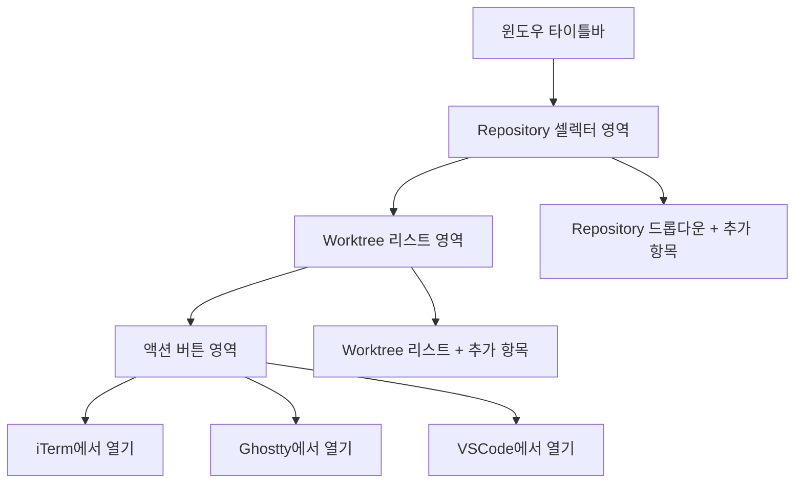
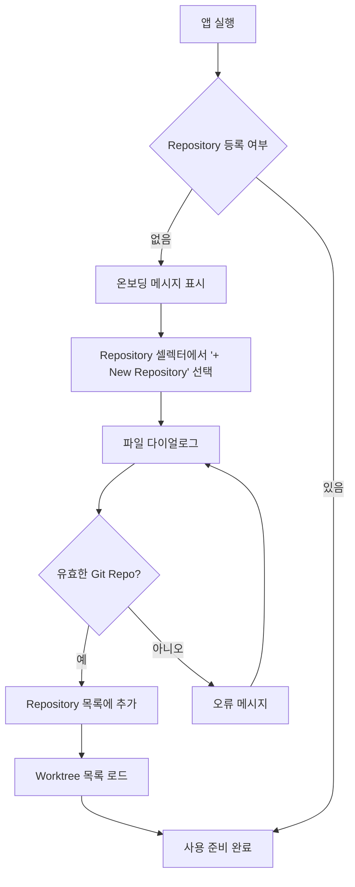
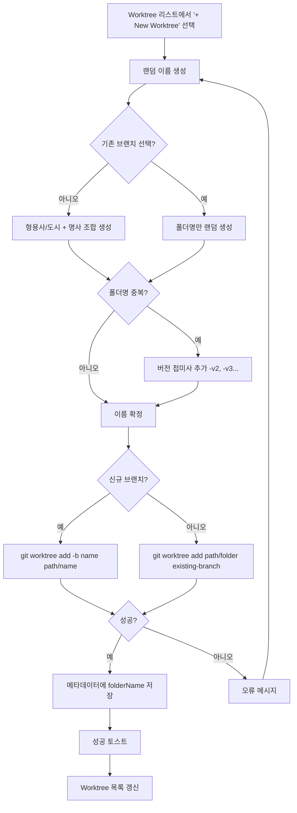
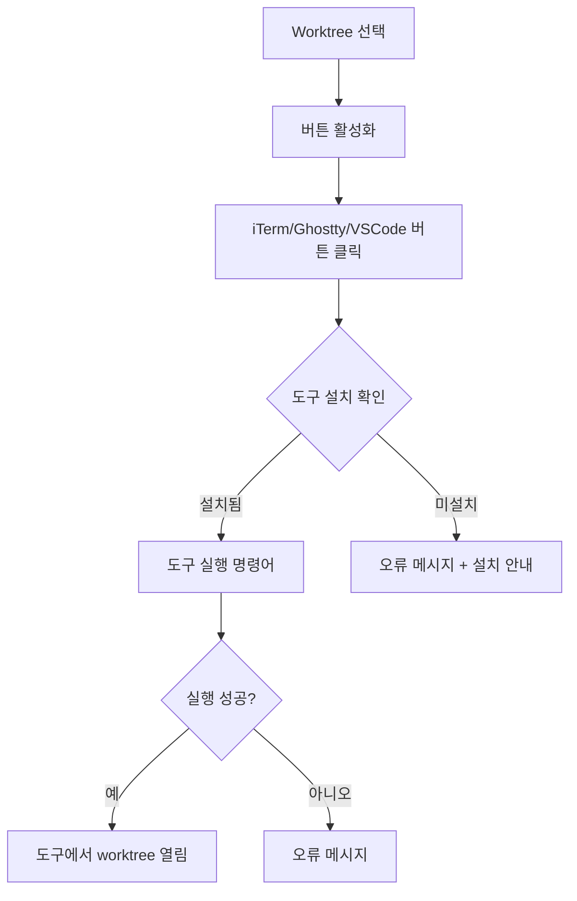
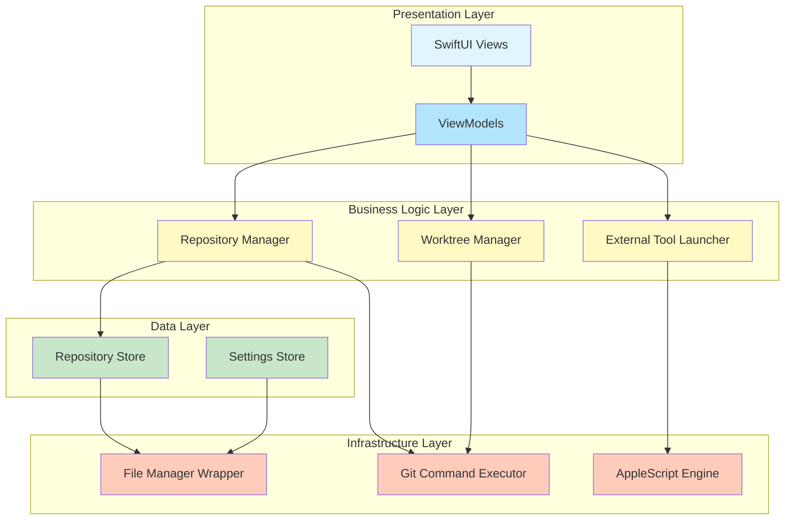
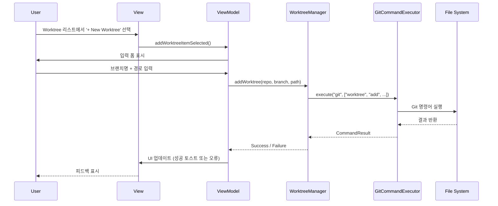
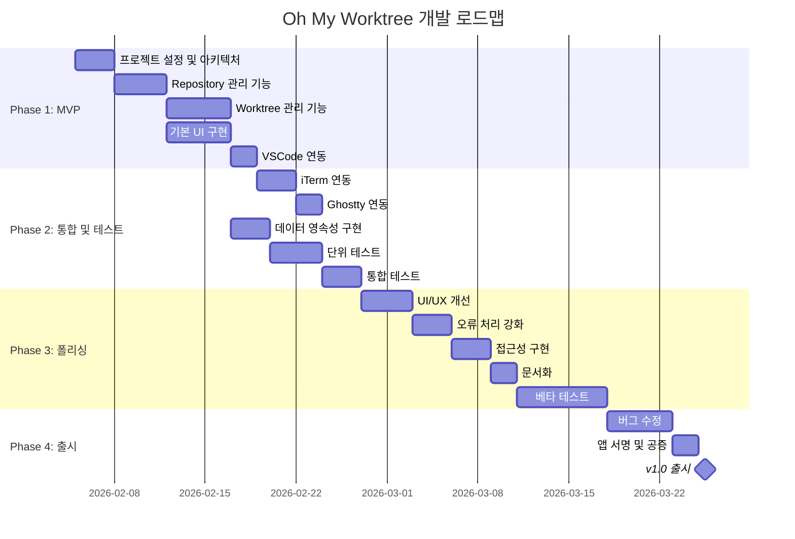

# Oh My Worktree - 제품 요구사항 문서 (PRD)

**버전**: 1.2
**작성일**: 2026-02-04
**대상 플랫폼**: macOS 14+ (Sonoma 이상)
**상태**: Draft

---

## 목차

1. [개요](#1-개요)
2. [목표](#2-목표)
3. [비목표](#3-비목표)
4. [사용자 스토리](#4-사용자-스토리)
5. [기능 요구사항](#5-기능-요구사항)
6. [비기능 요구사항](#6-비기능-요구사항)
7. [UI/UX 설계](#7-uiux-설계)
8. [기술 아키텍처](#8-기술-아키텍처)
9. [데이터 모델](#9-데이터-모델)
10. [마일스톤 및 로드맵](#10-마일스톤-및-로드맵)

---

## 1. 개요

### 1.1 제품 설명

**Oh My Worktree**는 Git worktree를 프로젝트별로 관리하는 경량화된 macOS 네이티브 유틸리티 애플리케이션입니다. Conductor와 유사한 접근 방식을 취하지만, 터미널 통합 없이 오로지 Git worktree의 생성, 조회, 삭제 및 외부 도구 연동에만 집중합니다.

### 1.2 배경

개발자들은 동일한 Git 저장소에서 여러 브랜치를 동시에 작업해야 하는 경우가 많습니다. Git worktree는 이를 가능하게 하지만, CLI 기반 관리는 불편하고 시각적 피드백이 부족합니다. Oh My Worktree는 이 문제를 해결하기 위해 간단하고 직관적인 GUI를 제공합니다.

### 1.3 대상 사용자

- Git worktree를 활용하는 소프트웨어 개발자
- 여러 브랜치를 동시에 작업하는 개발자
- macOS를 주 개발 환경으로 사용하는 사용자
- 경량화된 유틸리티 앱을 선호하는 사용자

---

## 2. 목표

### 2.1 핵심 목표

1. **단순성**: Git worktree 관리를 3번의 클릭 이내로 가능하게 함
2. **경량성**: 작은 윈도우 크기와 최소한의 리소스 사용
3. **통합성**: iTerm, Ghostty, VSCode와 원활한 연동
4. **안정성**: Git 명령어 실행 시 오류 처리 및 사용자 피드백

### 2.2 성공 지표

- 앱 실행 후 1초 이내 UI 로딩 완료
- 메모리 사용량 50MB 이하
- worktree 생성/삭제 작업 3초 이내 완료
- 외부 도구(iTerm/Ghostty/VSCode) 연동 성공률 99%

---

## 3. 비목표

다음 기능들은 **이번 버전의 범위에 포함되지 않습니다**:

- ❌ 내장 터미널 제공
- ❌ Git 기본 명령어(commit, push, pull 등) 지원
- ❌ 브랜치 병합, 리베이스 등 고급 Git 작업
- ❌ 파일 변경 사항 diff 뷰어
- ❌ Git 히스토리 시각화
- ❌ 멀티 플랫폼 지원 (Windows, Linux)
- ❌ 클라우드 동기화
- ❌ 팀 협업 기능
- ❌ CI/CD 통합
- ❌ 플러그인 시스템

---

## 4. 사용자 스토리

### 4.1 Repository 관리

**US-001**: Repository 추가
**우선순위**: P0
**사용자로서**, 나는 bare repository를 앱에 등록하여 여러 프로젝트를 관리하고 싶다.

**인수 조건**:
- Repository 셀렉터 내에 "+ New Repository" 항목이 표시됨
- 항목 선택 시 파일 다이얼로그를 통해 bare repository 경로 선택 가능
- 유효하지 않은 경로 입력 시 오류 메시지 표시
- 추가된 repository가 셀렉터에 즉시 표시됨

---

**US-002**: Repository 목록 조회
**우선순위**: P0
**사용자로서**, 나는 등록된 모든 repository를 드롭다운 또는 리스트에서 확인하고 싶다.

**인수 조건**:
- 등록된 모든 repository가 이름 또는 경로로 표시됨
- Repository 선택 시 해당 repository의 worktree 목록이 자동으로 로드됨

---

**US-003**: Repository 삭제
**우선순위**: P1
**사용자로서**, 나는 더 이상 사용하지 않는 repository를 목록에서 제거하고 싶다.

**인수 조건**:
- 컨텍스트 메뉴 또는 삭제 버튼으로 repository 제거 가능
- 삭제 확인 다이얼로그 표시
- 실제 디스크의 파일은 삭제되지 않음 (앱 내 등록만 해제)

---

### 4.2 Worktree 관리

**US-004**: Worktree 목록 조회
**우선순위**: P0
**사용자로서**, 나는 선택한 repository의 모든 worktree를 목록으로 확인하고 싶다.

**인수 조건**:
- `git worktree list --porcelain` 명령어 결과가 파싱되어 표시됨
- 각 worktree의 브랜치명, 경로, 상태가 표시됨
- 목록이 비어있을 경우 안내 메시지 표시
- 목록 로드 시마다 현재 브랜치명을 `git worktree list --porcelain`로 검증 (사용자가 CLI에서 브랜치 변경 가능)

---

**US-005**: Worktree 추가
**우선순위**: P0
**사용자로서**, 나는 새로운 브랜치의 worktree를 생성하고 싶다.

**인수 조건**:
- Worktree 리스트 내에 "+ New Worktree" 항목이 표시됨
- 항목 선택 시 폴더명과 브랜치명이 랜덤 단어 조합으로 자동 생성됨 (예: tokyo-lunch, bright-ocean)
- 생성된 이름은 폴더명과 초기 브랜치명으로 동시에 사용됨
- 동일한 폴더명이 존재할 경우 버전 접미사 자동 추가 (v2, v3, ...)
- 기존 브랜치 선택 옵션 제공 (선택 시 폴더명만 자동 생성)
- `git worktree add -b <name> <path/name>` 명령어 실행 후 목록 자동 갱신
- 브랜치명은 생성 후 사용자가 언제든지 변경 가능

---

**US-006**: Worktree 삭제
**우선순위**: P0
**사용자로서**, 나는 더 이상 필요하지 않은 worktree를 삭제하고 싶다.

**인수 조건**:
- 삭제 버튼 또는 컨텍스트 메뉴 제공
- 삭제 확인 다이얼로그 표시
- `git worktree remove` 명령어 실행
- 실제 디스크의 파일도 함께 삭제됨 (선택 옵션)

---

### 4.3 외부 도구 연동

**US-007**: iTerm에서 열기
**우선순위**: P0
**사용자로서**, 나는 선택한 worktree를 iTerm에서 바로 열고 싶다.

**인수 조건**:
- iTerm 새 탭 또는 새 윈도우로 열기 (설정 가능)
- 해당 worktree 경로로 자동 이동
- iTerm이 설치되지 않은 경우 안내 메시지 표시

---

**US-008**: Ghostty에서 열기
**우선순위**: P1
**사용자로서**, 나는 선택한 worktree를 Ghostty 터미널에서 바로 열고 싶다.

**인수 조건**:
- Ghostty 새 윈도우로 열기
- 해당 worktree 경로로 자동 이동
- Ghostty가 설치되지 않은 경우 안내 메시지 표시

---

**US-009**: VSCode에서 열기
**우선순위**: P0
**사용자로서**, 나는 선택한 worktree를 VSCode에서 바로 열고 싶다.

**인수 조건**:
- `code` 명령어로 VSCode 실행
- 해당 worktree 경로가 워크스페이스로 열림
- VSCode가 설치되지 않았거나 `code` 명령어가 없는 경우 안내 메시지 표시

---

### 4.4 설정 관리

**US-010**: 앱 설정 저장
**우선순위**: P1
**사용자로서**, 나는 앱 재시작 후에도 설정이 유지되기를 원한다.

**인수 조건**:
- 등록된 repository 목록이 자동 저장됨
- 윈도우 크기 및 위치가 저장됨
- 외부 도구 연동 설정이 저장됨

---

## 5. 기능 요구사항

### 5.1 Repository 관리 기능

#### FR-001: Repository 추가 (P0)

**설명**: 사용자가 로컬 bare repository를 앱에 등록할 수 있어야 함

**상세 요구사항**:
- Repository 셀렉터 내에 "+ New Repository" 항목 제공
- 항목 선택 시 파일 다이얼로그를 통한 디렉토리 선택
- `.git` 디렉토리 또는 bare repository 유효성 검증
- 중복 repository 추가 방지
- Repository 이름 자동 추출 (디렉토리 이름 기반)
- 수동 이름 변경 가능

**검증 로직**:
```swift
func isValidGitRepository(at path: String) -> Bool {
    let gitPath = "\(path)/.git"
    let bareGitPath = "\(path)/HEAD"
    return FileManager.default.fileExists(atPath: gitPath) ||
           FileManager.default.fileExists(atPath: bareGitPath)
}
```

---

#### FR-002: Repository 목록 표시 (P0)

**설명**: 등록된 모든 repository를 시각적으로 표시

**상세 요구사항**:
- 드롭다운 또는 리스트 UI 컴포넌트 사용
- Repository 이름과 경로 표시
- 선택된 repository 하이라이트
- 빈 목록일 경우 onboarding 메시지 표시

---

#### FR-003: Repository 삭제 (P1)

**설명**: 등록된 repository를 목록에서 제거

**상세 요구사항**:
- 컨텍스트 메뉴 또는 삭제 버튼
- 삭제 확인 다이얼로그 (실수 방지)
- 실제 파일은 삭제하지 않음 (앱 내 등록만 해제)

---

### 5.2 Worktree 관리 기능

#### FR-004: Worktree 목록 조회 (P0)

**설명**: 선택된 repository의 모든 worktree를 조회 및 표시

**상세 요구사항**:
- `git worktree list --porcelain` 명령어 실행
- 결과 파싱하여 구조화된 데이터로 변환
- 각 worktree의 다음 정보 표시:
  - 브랜치명 (항상 `git worktree list --porcelain`에서 실시간 조회)
  - 경로 (절대 경로)
  - 상태 (detached, bare 등)
  - HEAD 커밋 해시 (선택적)
- **중요**: 브랜치명은 메타데이터에 저장하지 않고, 매번 목록 로드 시 `git worktree list --porcelain`로 확인
- 이유: 사용자가 CLI에서 브랜치를 변경할 수 있으므로 실시간 동기화 필요

**데이터 파싱 예시**:
```
worktree /path/to/worktree
HEAD abc123def456
branch refs/heads/feature/new-feature
```

---

#### FR-005: Worktree 추가 (P0)

**설명**: 새로운 worktree를 자동 생성된 이름으로 생성

**상세 요구사항**:
- Worktree 리스트 내에 "+ New Worktree" 항목 제공
- 항목 선택 시 자동으로 랜덤 이름 생성 (FR-015 참조)
- 생성된 이름은 폴더명과 초기 브랜치명으로 동시 사용
- 기존 브랜치 선택 옵션 제공 (선택 시 폴더명만 자동 생성)
- Worktree 생성 경로: `~/oh-my-worktree/workspaces/{repository_name}/{worktree_name}`
- Git 명령어 실행:
  - 신규 브랜치 (기본): `git worktree add -b <name> ~/oh-my-worktree/workspaces/<repo>/<name>`
  - 기존 브랜치: `git worktree add ~/oh-my-worktree/workspaces/<repo>/<folder> <existing-branch>`
- 폴더명 중복 시 자동으로 버전 접미사 추가 (tokyo-lunch-v2, tokyo-lunch-v3)
- 실행 결과 피드백 (성공/실패 메시지)
- 성공 시 worktree 목록 자동 갱신
- 생성된 폴더명은 메타데이터에 저장 (FR-013 참조)

---

#### FR-006: Worktree 삭제 (P0)

**설명**: 기존 worktree를 제거

**상세 요구사항**:
- 삭제 확인 다이얼로그
- 옵션: "디스크에서도 삭제" (디폴트: true)
- Git 명령어 실행:
  - `git worktree remove <path>` (강제 삭제 옵션: `-f`)
- 실행 결과 피드백
- 성공 시 worktree 목록 자동 갱신

---

### 5.3 외부 도구 연동 기능

#### FR-007: iTerm 연동 (P0)

**설명**: 선택된 worktree를 iTerm에서 열기

**상세 요구사항**:
- AppleScript를 통한 iTerm 제어
- 설정 옵션:
  - 새 탭으로 열기 (디폴트)
  - 새 윈도우로 열기
- 실행 스크립트 예시:
```applescript
tell application "iTerm"
    create window with default profile command "cd /path/to/worktree"
end tell
```
- iTerm 미설치 시 오류 처리

---

#### FR-008: Ghostty 연동 (P1)

**설명**: 선택된 worktree를 Ghostty 터미널에서 열기

**상세 요구사항**:
- `open -a Ghostty <path>` 명령어로 실행
- Ghostty 미설치 시 오류 처리

---

#### FR-009: VSCode 연동 (P0)

**설명**: 선택된 worktree를 VSCode에서 열기

**상세 요구사항**:
- `code` CLI 명령어 사용
- 명령어: `code /path/to/worktree`
- `code` 명령어 미설치 시:
  - 설치 안내 메시지
  - VSCode 앱 직접 실행 대체 방법 (open -a "Visual Studio Code" /path)
- 설정 옵션:
  - 새 윈도우로 열기 (`-n` 플래그)
  - 현재 윈도우에 추가 (`-a` 플래그)

---

### 5.4 UI/UX 기능

#### FR-010: 컴팩트 윈도우 모드 (P0)

**설명**: 매우 작은 크기의 유틸리티 윈도우 제공

**상세 요구사항**:
- 초기 윈도우 크기: 500px × 400px
- 최소 크기: 400px × 300px
- 리사이징 가능
- 윈도우 위치 및 크기 저장/복원
- macOS 스타일 타이틀바

---

#### FR-011: 실시간 상태 피드백 (P1)

**설명**: Git 명령어 실행 중 사용자에게 진행 상황 표시

**상세 요구사항**:
- 로딩 인디케이터 (스피너)
- 진행 중 메시지 ("Worktree 생성 중...")
- 성공/실패 토스트 알림
- 오류 상세 정보 표시 (Git 오류 메시지)

---

#### FR-012: 키보드 단축키 (P2)

**설명**: 주요 기능에 대한 키보드 단축키 제공

**상세 요구사항**:
- `Cmd+N`: Repository 셀렉터에서 '+ New Repository' 항목 선택
- `Cmd+Shift+N`: Worktree 리스트에서 '+ New Worktree' 항목 선택
- `Cmd+Backspace`: 선택 항목 삭제
- `Cmd+T`: iTerm에서 열기
- `Cmd+Shift+T`: Ghostty에서 열기
- `Cmd+E`: VSCode에서 열기
- `Cmd+R`: 목록 새로고침

---

### 5.5 데이터 영속성 기능

#### FR-013: Repository 목록 및 Worktree 메타데이터 저장 (P0)

**설명**: 등록된 repository 목록과 worktree 메타데이터를 로컬에 영구 저장

**상세 요구사항**:
- 저장 방식: JSON 파일 (UserDefaults는 백업용)
- 저장 위치: `~/Library/Application Support/OhMyWorktree/repositories.json`
- 저장 데이터:
  - Repository UUID
  - 이름
  - 경로
  - 추가된 날짜
  - 마지막 접근 날짜
  - **Worktree 메타데이터** (각 repository별):
    - 폴더명 (folderName) - 안정적인 식별자
    - 생성 날짜
- **중요**: 브랜치명은 저장하지 않음 (항상 `git worktree list --porcelain`로 실시간 조회)

**데이터 구조**:
```json
{
  "repositories": [
    {
      "id": "uuid-string",
      "name": "MyProject",
      "path": "/Users/username/repos/myproject.git",
      "createdAt": "2026-02-04T12:00:00Z",
      "lastAccessedAt": "2026-02-04T15:30:00Z",
      "worktrees": [
        {
          "folderName": "tokyo-lunch",
          "createdAt": "2026-02-04T13:00:00Z"
        },
        {
          "folderName": "bright-ocean-v2",
          "createdAt": "2026-02-04T14:00:00Z"
        }
      ]
    }
  ]
}
```

---

#### FR-014: 앱 설정 저장 (P1)

**설명**: 사용자 설정을 저장 및 복원

**상세 요구사항**:
- UserDefaults 사용
- 저장 항목:
  - iTerm 열기 방식 (새 탭/새 윈도우)
  - VSCode 열기 방식 (새 윈도우/현재 윈도우)
  - 윈도우 크기 및 위치
  - 선택된 repository (마지막 선택)

---

#### FR-015: 랜덤 이름 생성 (P0)

**설명**: Worktree 생성 시 폴더명 및 브랜치명을 랜덤 단어 조합으로 자동 생성

**상세 요구사항**:
- 형용사/도시 + 명사 조합의 단어 풀 제공 (예: tokyo-lunch, bright-ocean, swift-river, cosmic-pizza)
- 생성된 이름은 폴더명과 초기 브랜치명으로 동시에 사용
- 이미 동일한 폴더명이 존재할 경우 자동으로 버전 접미사 추가 (v2, v3, ...)
- 단어 풀은 앱 내 하드코딩 (최소 50개 형용사/도시 + 50개 명사)
- 생성된 이름은 git branch 이름 규칙에 부합해야 함 (공백, 특수문자 금지)
- 이름 생성 알고리즘:
  1. 형용사/도시 풀에서 랜덤 선택
  2. 명사 풀에서 랜덤 선택
  3. 하이픈으로 결합 (예: `tokyo-lunch`)
  4. 폴더명 중복 체크 (기존 worktree 경로 확인)
  5. 중복 시 버전 접미사 추가 (`-v2`, `-v3`, ...)
  6. 최종 이름 반환

**단어 풀 예시**:
```swift
let adjectives = ["bright", "swift", "cosmic", "gentle", "bold", "quiet", ...]
let cities = ["tokyo", "paris", "seoul", "london", "berlin", ...]
let nouns = ["ocean", "river", "mountain", "forest", "sky", "lunch", "pizza", ...]
```

---

## 6. 비기능 요구사항

### 6.1 성능 요구사항

**NFR-001: 앱 실행 속도 (P0)**
- 콜드 스타트: 1초 이내
- 웜 스타트: 0.5초 이내
- 메모리 사용량: 50MB 이하 (idle 상태)

**NFR-002: Git 명령어 실행 속도 (P0)**
- `git worktree list`: 1초 이내
- `git worktree add`: 3초 이내
- `git worktree remove`: 2초 이내
- 타임아웃: 30초 (사용자에게 취소 옵션 제공)

**NFR-003: UI 반응성 (P0)**
- 클릭에서 반응까지: 100ms 이내
- 목록 스크롤: 60fps 유지
- 모든 Git 명령어는 백그라운드 스레드에서 실행

---

### 6.2 보안 요구사항

**NFR-004: 파일 시스템 접근 (P0)**
- Sandbox 모드에서 실행
- 사용자가 명시적으로 선택한 디렉토리만 접근
- macOS Security-Scoped Bookmarks 사용

**NFR-005: Git 명령어 보안 (P0)**
- 모든 경로 입력값 sanitize
- Shell injection 방지
- 신뢰할 수 없는 경로에서 Git 명령 실행 금지

---

### 6.3 안정성 요구사항

**NFR-006: 오류 처리 (P0)**
- 모든 Git 명령어 실행 결과 검증
- 오류 발생 시 사용자 친화적 메시지 표시
- 크래시 방지: try-catch로 모든 외부 명령어 감싸기
- 오류 로깅 (로컬 파일)

**NFR-007: 데이터 무결성 (P0)**
- Repository 경로 유효성 주기적 검증
- 존재하지 않는 repository 자동 제거 또는 표시
- JSON 파일 손상 시 백업에서 복구

---

### 6.4 호환성 요구사항

**NFR-008: macOS 버전 (P0)**
- 최소 지원: macOS 14 (Sonoma)
- 권장: macOS 15 (Sequoia)
- Apple Silicon (M1/M2/M3) 및 Intel 모두 지원

**NFR-009: Git 버전 (P0)**
- 최소 Git 버전: 2.30 이상
- Worktree 관련 버그가 수정된 버전 사용
- 앱 실행 시 Git 버전 확인 및 경고

**NFR-010: 외부 도구 (P1)**
- iTerm2 3.0 이상
- Ghostty 1.0 이상
- VSCode 1.80 이상
- 도구 미설치 시 graceful degradation

---

### 6.5 사용성 요구사항

**NFR-011: 직관성 (P0)**
- 첫 사용자가 튜토리얼 없이 사용 가능
- 명확한 라벨 및 아이콘
- macOS Human Interface Guidelines 준수

**NFR-012: 접근성 (P1)**
- VoiceOver 지원
- 키보드만으로 모든 기능 사용 가능
- 고대비 모드 지원
- Dynamic Type 지원

---

## 7. UI/UX 설계

### 7.1 전체 레이아웃



### 7.2 화면 구성

```
┌──────────────────────────────────────────┐
│ Oh My Worktree                        ⚙ │
├──────────────────────────────────────────┤
│ Repository                               │
│ ┌──────────────────────────────────────┐ │
│ │ MyProject                          ▼ │ │
│ │──────────────────────────────────────│ │
│ │ AnotherProject                       │ │
│ │──────────────────────────────────────│ │
│ │ + New Repository                     │ │
│ └──────────────────────────────────────┘ │
├──────────────────────────────────────────┤
│ Worktrees                                │
│ ┌──────────────────────────────────────┐ │
│ │ main                                 │ │
│ │ ~/repos/myproject/main               │ │
│ ├──────────────────────────────────────┤ │
│ │ feature/login                        │ │
│ │ ~/repos/myproject/login              │ │
│ ├──────────────────────────────────────┤ │
│ │ fix/bug-123                          │ │
│ │ ~/repos/myproject/bug                │ │
│ ├──────────────────────────────────────┤ │
│ │ + New Worktree                       │ │
│ └──────────────────────────────────────┘ │
│                                          │
│ Open in: [iTerm] [Ghostty] [VSCode]     │
└──────────────────────────────────────────┘
```

---

### 7.3 사용자 플로우

#### 플로우 1: 신규 사용자 온보딩



#### 플로우 2: Worktree 생성



#### 플로우 3: 외부 도구에서 열기



---

### 7.4 상호작용 설계

#### Worktree 리스트 아이템

각 worktree 아이템은 다음 정보를 표시:

```
┌────────────────────────────────────────┐
│ 🌿 feature/new-login                   │
│ 📁 /Users/username/repos/myapp/login   │
│ 🔄 Clean  |  🗑 Delete                  │
└────────────────────────────────────────┘
```

- **브랜치 아이콘**: 현재 브랜치 vs detached 상태 구분
- **경로**: 툴팁으로 전체 경로 표시 (잘린 경우)
- **상태**: Clean, Modified, Locked 등
- **액션**: 컨텍스트 메뉴 또는 호버 시 표시

#### 컨텍스트 메뉴

우클릭 시 표시되는 메뉴:
- 🖥 iTerm에서 열기
- 🖥 Ghostty에서 열기
- 🖥 VSCode에서 열기
- 📋 경로 복사
- 🗑 Worktree 삭제

---

### 7.5 색상 및 타이포그래피

#### 색상 팔레트 (macOS 다크/라이트 모드 지원)

| 요소 | 라이트 모드 | 다크 모드 |
|------|-------------|-----------|
| 배경 | #FFFFFF | #1E1E1E |
| 텍스트 (주) | #000000 | #FFFFFF |
| 텍스트 (부) | #6B6B6B | #A0A0A0 |
| 강조 색상 | #007AFF | #0A84FF |
| 성공 | #34C759 | #30D158 |
| 오류 | #FF3B30 | #FF453A |
| 경고 | #FF9500 | #FF9F0A |

#### 타이포그래피

- **제목**: SF Pro Display, 16pt, Bold
- **본문**: SF Pro Text, 13pt, Regular
- **보조 텍스트**: SF Pro Text, 11pt, Regular
- **모노스페이스 (경로)**: SF Mono, 12pt, Regular

---

## 8. 기술 아키텍처

### 8.1 기술 스택

| 레이어 | 기술 |
|--------|------|
| UI 프레임워크 | SwiftUI |
| 언어 | Swift 5.9+ |
| 최소 OS | macOS 14 (Sonoma) |
| 아키텍처 패턴 | MVVM (Model-View-ViewModel) |
| Git 통합 | Process / NSTask (Git CLI) |
| 데이터 영속성 | Codable + FileManager + UserDefaults |
| 외부 도구 연동 | AppleScript / Process |
| 테스트 | XCTest + Swift Testing |

---

### 8.2 아키텍처 다이어그램



---

### 8.3 주요 컴포넌트

#### 8.3.1 GitCommandExecutor

Git 명령어를 실행하는 저수준 래퍼

```swift
protocol GitCommandExecutor {
    func execute(
        command: String,
        arguments: [String],
        workingDirectory: String?
    ) async throws -> CommandResult
}

struct CommandResult {
    let stdout: String
    let stderr: String
    let exitCode: Int32
}
```

**책임**:
- Process를 통한 Git CLI 실행
- 표준 출력/에러 캡처
- 타임아웃 처리
- 오류 코드 해석

---

#### 8.3.2 WorktreeManager

Worktree 관련 비즈니스 로직

```swift
protocol WorktreeManager {
    func listWorktrees(for repository: Repository) async throws -> [Worktree]
    func addWorktree(
        repository: Repository,
        branch: String,
        path: String,
        isNewBranch: Bool
    ) async throws
    func removeWorktree(
        repository: Repository,
        worktree: Worktree,
        force: Bool
    ) async throws
}
```

**책임**:
- `git worktree list --porcelain` 파싱
- `git worktree add` 실행 및 검증
- `git worktree remove` 실행
- 오류 처리 및 재시도 로직

---

#### 8.3.3 RepositoryStore

Repository 데이터 영속성 관리

```swift
protocol RepositoryStore {
    func loadRepositories() async throws -> [Repository]
    func saveRepositories(_ repositories: [Repository]) async throws
    func addRepository(_ repository: Repository) async throws
    func removeRepository(id: UUID) async throws
}
```

**책임**:
- JSON 파일 읽기/쓰기
- 데이터 검증 및 마이그레이션
- 백업 및 복구

---

#### 8.3.4 ExternalToolLauncher

외부 도구 실행

```swift
protocol ExternalToolLauncher {
    func openInITerm(path: String, newWindow: Bool) async throws
    func openInGhostty(path: String) async throws
    func openInVSCode(path: String, newWindow: Bool) async throws
}
```

**책임**:
- AppleScript 실행 (iTerm)
- Process 실행 (Ghostty, VSCode)
- 도구 설치 여부 확인
- 오류 처리

---

### 8.4 데이터 플로우



---

### 8.5 오류 처리 전략

#### 오류 계층 구조

```swift
enum OhMyWorktreeError: LocalizedError {
    case gitNotInstalled
    case invalidGitRepository(path: String)
    case worktreeAlreadyExists(branch: String)
    case worktreeNotFound(path: String)
    case externalToolNotFound(tool: String)
    case commandExecutionFailed(command: String, stderr: String)
    case permissionDenied(path: String)

    var errorDescription: String? {
        // 사용자 친화적 메시지
    }

    var recoverySuggestion: String? {
        // 해결 방법 제안
    }
}
```

#### 오류 처리 정책

| 오류 유형 | 처리 방법 | 사용자 피드백 |
|-----------|-----------|---------------|
| Git 미설치 | 앱 실행 중단, 설치 안내 | 다이얼로그 + 설치 링크 |
| 잘못된 Repository | 추가 거부 | 인라인 오류 메시지 |
| Worktree 충돌 | 명령어 실패 | 토스트 + 상세 정보 |
| 외부 도구 미설치 | 기능 비활성화 | 버튼 비활성 + 툴팁 |
| 권한 오류 | 재시도 옵션 | 다이얼로그 + 권한 요청 |

---

## 9. 데이터 모델

### 9.1 핵심 모델

#### Repository

```swift
struct Repository: Identifiable, Codable {
    let id: UUID
    var name: String
    let path: String
    let createdAt: Date
    var lastAccessedAt: Date

    var isValid: Bool {
        FileManager.default.fileExists(atPath: path)
    }
}
```

**속성**:
- `id`: 고유 식별자
- `name`: 사용자 정의 이름
- `path`: bare repository의 절대 경로
- `createdAt`: 등록 시각
- `lastAccessedAt`: 마지막 접근 시각 (정렬용)

---

#### Worktree

```swift
struct Worktree: Identifiable {
    let id: UUID
    let path: String
    let folderName: String  // 폴더명 (메타데이터에 저장되는 유일한 식별자)
    let branch: String?  // 브랜치명 (항상 git worktree list로 실시간 조회, 저장하지 않음)
    let commitHash: String
    let isDetached: Bool
    let isBare: Bool
    let isLocked: Bool

    var displayName: String {
        branch ?? "Detached (\(commitHash.prefix(7)))"
    }
}
```

**속성**:
- `id`: 고유 식별자
- `path`: worktree의 절대 경로
- `folderName`: 폴더명 (불변, 메타데이터 저장용)
- `branch`: 브랜치명 (detached 상태면 nil, 항상 `git worktree list --porcelain`로 실시간 조회)
- `commitHash`: HEAD 커밋 해시
- `isDetached`: detached HEAD 상태 여부
- `isBare`: bare worktree 여부
- `isLocked`: locked 상태 여부

**중요**:
- `branch`는 메타데이터에 저장되지 않음 (사용자가 CLI에서 브랜치 변경 가능)
- `folderName`은 불변이며 worktree의 안정적인 식별자로 사용됨

---

#### AppSettings

```swift
struct AppSettings: Codable {
    var iTermOpenMode: OpenMode = .newTab
    var vscodeOpenMode: OpenMode = .newWindow
    var lastSelectedRepositoryID: UUID?
    var windowFrame: NSRect?

    enum OpenMode: String, Codable {
        case newTab
        case newWindow
        case currentWindow
    }
}
```

---

### 9.2 뷰모델

#### RepositoryListViewModel

```swift
@MainActor
class RepositoryListViewModel: ObservableObject {
    @Published var repositories: [Repository] = []
    @Published var selectedRepository: Repository?
    @Published var isLoading = false
    @Published var errorMessage: String?

    func loadRepositories() async
    func addRepository(at path: String, name: String) async
    func removeRepository(_ repository: Repository) async
}
```

---

#### WorktreeListViewModel

```swift
@MainActor
class WorktreeListViewModel: ObservableObject {
    @Published var worktrees: [Worktree] = []
    @Published var selectedWorktree: Worktree?
    @Published var isLoading = false
    @Published var errorMessage: String?

    var repository: Repository?

    func loadWorktrees() async
    func addWorktree(branch: String, path: String, isNew: Bool) async
    func removeWorktree(_ worktree: Worktree, force: Bool) async
    func openInITerm(_ worktree: Worktree) async
    func openInGhostty(_ worktree: Worktree) async
    func openInVSCode(_ worktree: Worktree) async
}
```

---

### 9.3 데이터베이스 스키마 (JSON)

#### repositories.json

```json
{
  "version": "1.0",
  "repositories": [
    {
      "id": "550e8400-e29b-41d4-a716-446655440000",
      "name": "MyProject",
      "path": "/Users/username/repos/myproject.git",
      "createdAt": "2026-02-04T12:00:00Z",
      "lastAccessedAt": "2026-02-04T15:30:00Z",
      "worktrees": [
        {
          "folderName": "tokyo-lunch",
          "createdAt": "2026-02-04T13:00:00Z"
        },
        {
          "folderName": "bright-ocean-v2",
          "createdAt": "2026-02-04T14:00:00Z"
        }
      ]
    }
  ]
}
```

**참고**: 브랜치명은 저장되지 않으며, 항상 `git worktree list --porcelain`로 실시간 조회됩니다.

#### settings.json

```json
{
  "version": "1.0",
  "iTermOpenMode": "newTab",
  "vscodeOpenMode": "newWindow",
  "lastSelectedRepositoryID": "550e8400-e29b-41d4-a716-446655440000",
  "windowFrame": {
    "x": 100,
    "y": 100,
    "width": 500,
    "height": 400
  }
}
```

---

## 10. 마일스톤 및 로드맵

### 10.1 개발 단계



---

### 10.2 Phase 1: MVP (14일)

**목표**: 핵심 기능이 동작하는 최소 제품 구현

**작업 항목**:
- [x] Xcode 프로젝트 생성 및 SwiftUI 설정
- [ ] MVVM 아키텍처 기본 구조 구현
- [ ] GitCommandExecutor 구현
- [ ] Repository 추가/삭제 기능
- [ ] Worktree 목록 조회 (`git worktree list` 파싱)
- [ ] Worktree 추가 기능 (`git worktree add`)
- [ ] Worktree 삭제 기능 (`git worktree remove`)
- [ ] 기본 UI 레이아웃 (Repository/Worktree 셀렉터)
- [ ] VSCode 연동 (가장 간단한 통합부터)

**검증 기준**:
- [ ] 사용자가 repository를 추가하고 worktree를 생성/삭제할 수 있음
- [ ] Worktree를 VSCode에서 열 수 있음
- [ ] 기본적인 오류 처리 (Git 오류 메시지 표시)

---

### 10.3 Phase 2: 통합 및 테스트 (15일)

**목표**: 모든 외부 도구 연동 완성 및 안정성 확보

**작업 항목**:
- [ ] iTerm AppleScript 연동 구현
- [ ] Ghostty CLI 연동 구현
- [ ] RepositoryStore 구현 (JSON 저장/로드)
- [ ] AppSettings 구현 (UserDefaults)
- [ ] 윈도우 크기/위치 저장 및 복원
- [ ] 단위 테스트 작성 (GitCommandExecutor, WorktreeManager)
- [ ] 통합 테스트 작성 (전체 플로우)
- [ ] 오류 시나리오 테스트 (Git 오류, 권한 오류 등)

**검증 기준**:
- [ ] 모든 외부 도구 연동이 정상 동작
- [ ] 데이터가 앱 재시작 후에도 유지됨
- [ ] 테스트 커버리지 70% 이상
- [ ] 알려진 크래시 없음

---

### 10.4 Phase 3: 폴리싱 (17일)

**목표**: 사용자 경험 최적화 및 출시 준비

**작업 항목**:
- [ ] UI 애니메이션 및 트랜지션 추가
- [ ] 로딩 인디케이터 및 토스트 알림
- [ ] 상세한 오류 메시지 및 복구 제안
- [ ] VoiceOver 지원
- [ ] 키보드 내비게이션 최적화
- [ ] 고대비 모드 및 Dynamic Type 지원
- [ ] 사용자 가이드 작성
- [ ] 개발자 문서 작성
- [ ] 베타 테스터 모집 및 피드백 수집
- [ ] 베타 버전 배포 (TestFlight)

**검증 기준**:
- [ ] 베타 테스터로부터 긍정적 피드백
- [ ] 접근성 체크리스트 100% 통과
- [ ] 성능 목표 달성 (NFR 섹션 참조)
- [ ] 문서화 완료

---

### 10.5 Phase 4: 출시 (7일)

**목표**: 안정적인 v1.0 출시

**작업 항목**:
- [ ] 베타 피드백 기반 버그 수정
- [ ] 앱 서명 (Apple Developer Certificate)
- [ ] 공증 (Notarization)
- [ ] GitHub Release 준비 (Release Notes)
- [ ] 웹사이트 또는 랜딩 페이지 준비 (선택)
- [ ] v1.0 출시

**검증 기준**:
- [ ] 모든 P0 기능 동작
- [ ] 크리티컬 버그 없음
- [ ] 앱이 macOS Gatekeeper를 통과
- [ ] 설치 및 실행이 원활함

---

### 10.6 향후 로드맵 (v1.1+)

**Phase 5: 추가 기능 (선택)**

| 기능 | 우선순위 | 예상 일정 |
|------|----------|-----------|
| Worktree 이름 변경 | P2 | v1.1 |
| 브랜치 전환 (in worktree) | P2 | v1.1 |
| 커밋 히스토리 간단 표시 | P2 | v1.2 |
| 다른 터미널 앱 지원 (Alacritty 등) | P2 | v1.2 |
| Xcode 연동 | P2 | v1.3 |
| 테마 커스터마이징 | P2 | v1.3 |
| 단축키 커스터마이징 | P2 | v1.3 |
| iCloud 동기화 (Repository 목록) | P2 | v1.4 |

---

## 부록

### A. Git Worktree 명령어 참조

#### `git worktree list`

**목적**: 현재 저장소의 모든 worktree 목록 조회

**사용법**:
```bash
git worktree list --porcelain
```

**출력 예시**:
```
worktree /path/to/main
HEAD abc123def456
branch refs/heads/main

worktree /path/to/feature
HEAD def456abc123
branch refs/heads/feature/new-feature

worktree /path/to/detached
HEAD 789xyz456abc
detached
```

**파싱 규칙**:
- `worktree <path>`: worktree 경로
- `HEAD <hash>`: 커밋 해시
- `branch refs/heads/<name>`: 브랜치 참조
- `detached`: detached HEAD 상태
- `bare`: bare worktree
- `locked <reason>`: locked 상태

---

#### `git worktree add`

**목적**: 새로운 worktree 생성

**사용법**:
```bash
# 기존 브랜치로 worktree 생성
git worktree add <path> <branch>

# 새 브랜치로 worktree 생성
git worktree add -b <new-branch> <path> <start-point>
```

**예시**:
```bash
git worktree add ../feature-login feature/login
git worktree add -b feature/new-feature ../new-feature main
```

**옵션**:
- `-b <branch>`: 새 브랜치 생성
- `-B <branch>`: 기존 브랜치 리셋 (강제)
- `--detach`: detached HEAD로 생성
- `--force`: 이미 체크아웃된 브랜치도 생성 (주의!)

---

#### `git worktree remove`

**목적**: 기존 worktree 삭제

**사용법**:
```bash
git worktree remove <path>
```

**옵션**:
- `--force`: 변경사항이 있어도 강제 삭제

**주의사항**:
- Worktree 디렉토리가 자동으로 삭제됨
- Git 메타데이터 (.git/worktrees)도 정리됨

---

### B. AppleScript 예시

#### iTerm 새 탭으로 열기

```applescript
tell application "iTerm"
    tell current window
        create tab with default profile command "cd /path/to/worktree && clear"
    end tell
end tell
```

#### iTerm 새 윈도우로 열기

```applescript
tell application "iTerm"
    create window with default profile command "cd /path/to/worktree && clear"
end tell
```

---

### C. 참고 자료

**Git 공식 문서**:
- [Git Worktree Documentation](https://git-scm.com/docs/git-worktree)

**macOS 개발 가이드**:
- [Human Interface Guidelines](https://developer.apple.com/design/human-interface-guidelines/macos)
- [SwiftUI Documentation](https://developer.apple.com/documentation/swiftui)

**유사 도구**:
- [Conductor](https://github.com/conductorapp/conductor) - 터미널 통합이 포함된 Git 관리 앱

---

### D. 용어 정의

| 용어 | 정의 |
|------|------|
| **Bare Repository** | 작업 디렉토리가 없는 Git 저장소 (.git 디렉토리만 존재) |
| **Worktree** | Git 저장소의 작업 복사본 (working directory) |
| **Detached HEAD** | 특정 브랜치가 아닌 커밋을 직접 체크아웃한 상태 |
| **Locked Worktree** | 삭제 방지를 위해 잠긴 worktree |
| **AppleScript** | macOS 앱 간 자동화를 위한 스크립팅 언어 |
| **Sandbox** | macOS 보안 기능으로 앱의 파일 시스템 접근 제한 |

---

## 변경 이력

| 버전 | 날짜 | 변경 내역 | 작성자 |
|------|------|-----------|--------|
| 1.0 | 2026-02-04 | 초안 작성 | Claude Code Writer |
| 1.1 | 2026-02-04 | Worktree 랜덤 이름 생성, 메타데이터 폴더명 기반 관리 추가 | Claude Code |
| 1.2 | 2026-02-04 | Ghostty 연동을 open -a 방식으로 변경, Worktree 경로를 ~/oh-my-worktree/workspaces로 변경 | Claude Code |

---

**문서 종료**
